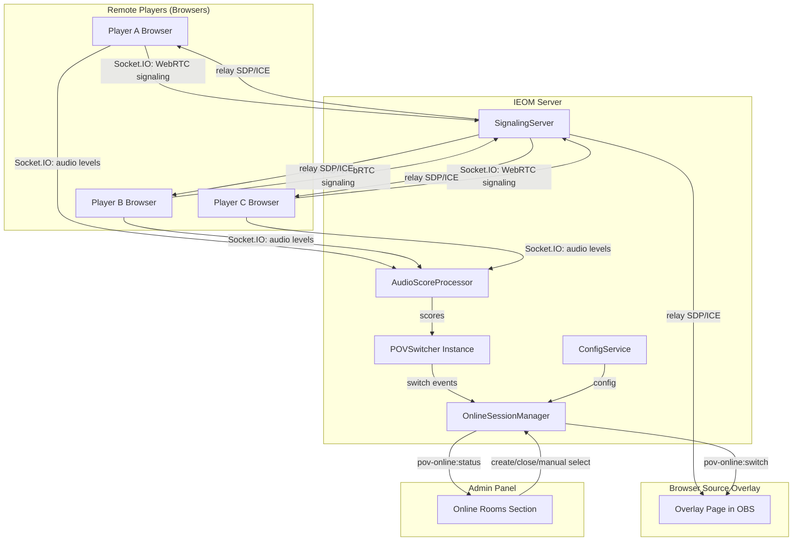

# Design Document: Browser POV Online

## Overview

Browser POV Online extends the existing Multi-Camera POV Switching system with a remote-player mode where participants connect via web browser instead of running local OBS instances. Remote players share their camera and microphone through WebRTC, send client-side audio level data to the server via Socket.IO, and the server reuses the existing `POVSwitcher` decision engine to determine the active speaker. The host captures the active feed in OBS using a Browser Source overlay that renders the currently active player's video full-screen.

Key architectural decisions:
- **Reuse POVSwitcher**: Each online room gets its own `POVSwitcher` instance (same class, separate state from LAN mode)
- **Client-side audio analysis**: Audio levels are computed in the browser using Web Audio API, not polled from OBS
- **WebRTC mesh signaling**: The server acts as a signaling relay only — no media passes through the server
- **Ephemeral rooms**: Online rooms exist only in memory and are not persisted to the database
- **Coexistence**: LAN mode and Online mode operate independently with no shared state

## Architecture



### Key Design Decisions

1. **Separate POVSwitcher instances per room**: Each `OnlineRoom` instantiates its own `POVSwitcher` with a lightweight in-memory `ParticipantRegistry` (implementing the same interface the switcher expects). This ensures LAN and Online modes never interfere.

2. **Client-side audio analysis**: Instead of polling OBS audio meters (LAN approach), the Player Client computes RMS audio levels locally using the Web Audio API `AnalyserNode` and sends periodic reports via Socket.IO. This eliminates the need for server-side audio processing infrastructure.

3. **WebRTC mesh topology**: For rooms of up to 10 players, a full-mesh WebRTC topology is acceptable. Each player establishes peer connections with the overlay (and optionally with other players for future features). The server only relays signaling messages (SDP offers/answers, ICE candidates).

4. **Ephemeral rooms**: Online rooms are stored only in a `Map<string, OnlineRoom>` in server memory. On server restart, all rooms are lost. This simplifies the design and avoids complex state recovery for transient sessions.

5. **Overlay as WebRTC consumer**: The Browser Source Overlay page connects to all players via WebRTC to receive their video streams, but only displays the active player's stream. This allows instant switching without renegotiation.

6. **Socket.IO namespaces**: Online mode uses a dedicated `/online` namespace to isolate its events from the existing LAN mode events on the default namespace.

## Components and Interfaces

### 1. OnlineSessionManager (Server — `packages/server/src/online/session-manager.ts`)

Central coordinator for online rooms. Creates/destroys rooms, manages participant lifecycle, and wires audio scores to per-room POVSwitcher instances.

```typescript
interface OnlineRoomConfig {
  maxPlayersPerRoom: number    // Default 10, range 2-20
  maxActiveRooms: number       // Default 5, range 1-10
  audioReportIntervalMs: number // Default 100, range 50-500
  rollingWindowMs: number      // Default 2000, range 500-10000
  cooldownMs: number           // Default 3000, range 1000-30000
  activityThreshold: number    // Default 0.15, range 0.01-1.0
  silenceThreshold: number     // Default 0.05, range 0.0-1.0
  scoreEmitIntervalMs: number  // Default 500
  idleTimeoutMs: number        // Default 60000
}

interface OnlineRoom {
  roomCode: string             // 6-char uppercase alphanumeric
  createdAt: number            // Unix timestamp
  maxPlayers: number           // Configured capacity
  participants: Map<string, Participant>
  switcher: POVSwitcher        // Per-room instance
  scoreProcessor: AudioScoreProcessor
  status: 'active' | 'idle'
  idleTimer: NodeJS.Timeout | null
}

interface Participant {
  id: string                   // Unique participant ID (UUID)
  displayName: string          // 1-32 characters
  socketId: string             // Socket.IO socket ID
  joinedAt: number             // Unix timestamp
  connectionStatus: 'connected' | 'disconnected'
  lastAudioReport: number      // Timestamp of last audio level report
}

interface OnlineSessionManager {
  createRoom(): { roomCode: string; joinUrl: string } | { error: string }
  closeRoom(roomCode: string): void
  getRoom(roomCode: string): OnlineRoom | undefined
  getActiveRooms(): OnlineRoom[]
  joinRoom(roomCode: string, displayName: string, socketId: string): { participantId: string } | { error: string }
  leaveRoom(roomCode: string, participantId: string): void
  handleAudioReport(roomCode: string, participantId: string, level: number): void
  manualSelect(roomCode: string, participantId: string): { ok: boolean; error?: string }
  setMode(roomCode: string, mode: SwitchMode): void
  updateConfig(config: Partial<OnlineRoomConfig>): void
}
```

### 2. AudioScoreProcessor (Server — `packages/server/src/online/audio-score-processor.ts`)

Computes rolling-average Activity Scores from client-reported audio levels. One instance per room.

```typescript
interface AudioScoreProcessor {
  /** Process an incoming audio level report (0-1 linear) */
  reportLevel(participantId: string, level: number, timestamp: number): void
  
  /** Get current activity scores for all participants */
  getScores(): Map<string, number>
  
  /** Remove a participant from tracking */
  removeParticipant(participantId: string): void
  
  /** Start periodic score emission */
  start(config: { rollingWindowMs: number; reportIntervalMs: number; emitIntervalMs: number }): void
  
  /** Stop periodic emission */
  stop(): void
  
  /** Register callback for score updates */
  onScoresUpdated(callback: (scores: Map<string, number>) => void): void
}
```

The processor maintains a circular buffer of timestamped readings per participant. Activity Score = mean of readings within the rolling window. If a participant misses 3 consecutive expected intervals, their score is set to 0. When reports resume, only new readings are used (no carry-over of zeros).

### 3. SignalingServer (Server — `packages/server/src/online/signaling.ts`)

Relays WebRTC signaling messages between peers via Socket.IO. Does not inspect or modify media content.

```typescript
interface SignalingMessage {
  type: 'offer' | 'answer' | 'ice-candidate'
  from: string                 // Participant ID or 'overlay'
  to: string                   // Target participant ID or 'overlay'
  roomCode: string
  payload: RTCSessionDescriptionInit | RTCIceCandidateInit
}

interface SignalingServer {
  /** Handle incoming signaling message and relay to target */
  relay(message: SignalingMessage): void
  
  /** Notify all participants in a room about a new peer */
  notifyNewPeer(roomCode: string, participantId: string, displayName: string): void
  
  /** Notify all participants about a peer disconnection */
  notifyPeerDisconnect(roomCode: string, participantId: string): void
}
```

### 4. ParticipantRegistry (Server — `packages/server/src/online/participant-registry.ts`)

Lightweight adapter that implements the interface expected by `POVSwitcher` (same as `CameraRegistry` for LAN mode) but backed by the room's participant map.

```typescript
interface ParticipantRegistry {
  /** Get a participant as a "feed" for the POVSwitcher */
  getActiveFeed(participantId: string): { id: string; connectionStatus: 'connected' | 'disconnected'; activityScore: number } | undefined
  
  /** Get all connected participants as "feeds" */
  getConnectedFeeds(): Array<{ id: string; connectionStatus: 'connected'; activityScore: number }>
  
  /** Update activity score for a participant */
  updateActivityScore(participantId: string, score: number): void
}
```

### 5. Player Client (Frontend — `packages/overlay/src/online/player/`)

Browser-based application for remote players. Handles media capture, audio analysis, WebRTC connections, and Socket.IO communication.

```typescript
// Audio level analyzer (runs in browser)
interface AudioLevelAnalyzer {
  /** Start analyzing audio from a MediaStream */
  start(stream: MediaStream, intervalMs: number): void
  
  /** Stop analysis */
  stop(): void
  
  /** Get current audio level (0-1 linear, RMS normalized) */
  getCurrentLevel(): number
  
  /** Register callback for periodic level reports */
  onLevel(callback: (level: number) => void): void
}

// RMS computation (pure function, testable)
function computeRmsLevel(frequencyData: Uint8Array): number
```

### 6. Browser Source Overlay (Frontend — `packages/overlay/src/online/overlay/`)

Dedicated page rendered in OBS Browser Source. Receives all player video streams via WebRTC, displays only the active player.

```typescript
interface OverlayState {
  roomCode: string
  activePlayerId: string | null
  participants: Map<string, { stream: MediaStream | null; displayName: string }>
  transitionType: 'cut' | 'fade'
  transitionDurationMs: number
}
```

### 7. Socket.IO Events — Online Namespace (`/online`)

New events on a dedicated namespace, defined in `@ieom/shared`:

```typescript
// ── Server → Client (Admin) ──────────────────────────────────────
'pov-online:room:created': (payload: { roomCode: string; joinUrl: string; createdAt: number }) => void
'pov-online:room:closed': (payload: { roomCode: string }) => void
'pov-online:room:idle': (payload: { roomCode: string }) => void
'pov-online:participant:joined': (payload: { roomCode: string; participant: ParticipantInfo }) => void
'pov-online:participant:left': (payload: { roomCode: string; participantId: string }) => void
'pov-online:scores': (payload: { roomCode: string; scores: Array<{ participantId: string; score: number }>; timestamp: number }) => void
'pov-online:switch': (payload: { roomCode: string; previousId: string | null; newId: string; timestamp: number; reason: SwitchReason }) => void
'pov-online:status': (payload: OnlineRoomStatus) => void

// ── Server → Client (Player) ─────────────────────────────────────
'pov-online:joined': (payload: { participantId: string; roomCode: string; participants: ParticipantInfo[] }) => void
'pov-online:join:error': (payload: { error: string; code: 'room_not_found' | 'room_full' | 'invalid_name' }) => void
'pov-online:peer:joined': (payload: { participantId: string; displayName: string }) => void
'pov-online:peer:left': (payload: { participantId: string }) => void
'pov-online:room:closed': (payload: { roomCode: string }) => void

// ── Server → Client (Overlay) ────────────────────────────────────
'pov-online:switch': (payload: { previousId: string | null; newId: string; timestamp: number }) => void
'pov-online:peer:joined': (payload: { participantId: string; displayName: string }) => void
'pov-online:peer:left': (payload: { participantId: string }) => void

// ── Client → Server (Player) ─────────────────────────────────────
'pov-online:join': (payload: { roomCode: string; displayName: string }, ack: (response: { ok: boolean; participantId?: string; error?: string }) => void) => void
'pov-online:audio-level': (payload: { level: number }) => void
'pov-online:signal': (payload: SignalingMessage) => void

// ── Client → Server (Admin) ──────────────────────────────────────
'pov-online:room:create': (ack: (response: { ok: boolean; roomCode?: string; joinUrl?: string; error?: string }) => void) => void
'pov-online:room:close': (payload: { roomCode: string }) => void
'pov-online:mode:set': (payload: { roomCode: string; mode: SwitchMode }) => void
'pov-online:select': (payload: { roomCode: string; participantId: string }, ack: (response: { ok: boolean; error?: string }) => void) => void

// ── Client → Server (Overlay) ────────────────────────────────────
'pov-online:overlay:subscribe': (payload: { roomCode: string }) => void
'pov-online:signal': (payload: SignalingMessage) => void
```

### 8. REST Endpoints

```
GET    /api/config/online       — Get online mode configuration
PATCH  /api/config/online       — Update online mode configuration
GET    /api/online/rooms        — List all active online rooms
GET    /online/room/:roomCode   — Serve Player Client SPA
GET    /online/overlay/:roomCode — Serve Browser Source Overlay page
```

### 9. Admin Panel Component (Admin — `packages/admin/src/features/pov/OnlineRoomsPanel.tsx`)

React component displaying:
- List of active online rooms with room code, join URL (copyable), participant count, creation time
- Create Room button
- Per-room expandable section showing participants with display name, connection status, activity score bar
- Active player highlight
- Mode toggle and config controls (reusing existing POV config UI patterns)
- Close Room button with confirmation
- Browser Source URL display per room

## Data Models

### Online Mode Configuration (persisted in `online_config` table)

```typescript
interface OnlineModeConfig {
  audioReportIntervalMs: number  // Default 100, range 50-500
  rollingWindowMs: number        // Default 2000, range 500-10000
  cooldownMs: number             // Default 3000, range 1000-30000
  activityThreshold: number      // Default 0.15, range 0.01-1.0
  silenceThreshold: number       // Default 0.05, range 0.0-1.0
  maxPlayersPerRoom: number      // Default 10, range 2-20
  maxActiveRooms: number         // Default 5, range 1-10
  scoreEmitIntervalMs: number    // Default 500
  idleTimeoutMs: number          // Default 60000
  transition: TransitionConfig   // Reuses existing type
}
```

### Database Schema Addition

```sql
-- Online mode configuration (single-row, id=1)
CREATE TABLE IF NOT EXISTS online_config (
  id INTEGER PRIMARY KEY DEFAULT 1,
  audio_report_interval_ms INTEGER NOT NULL DEFAULT 100,
  rolling_window_ms INTEGER NOT NULL DEFAULT 2000,
  cooldown_ms INTEGER NOT NULL DEFAULT 3000,
  activity_threshold REAL NOT NULL DEFAULT 0.15,
  silence_threshold REAL NOT NULL DEFAULT 0.05,
  max_players_per_room INTEGER NOT NULL DEFAULT 10,
  max_active_rooms INTEGER NOT NULL DEFAULT 5,
  score_emit_interval_ms INTEGER NOT NULL DEFAULT 500,
  idle_timeout_ms INTEGER NOT NULL DEFAULT 60000,
  transition_type TEXT NOT NULL DEFAULT 'cut',
  transition_duration_ms INTEGER NOT NULL DEFAULT 0
);
```

### Runtime State (in-memory only — NOT persisted)

```typescript
// Managed by OnlineSessionManager
interface OnlineRuntimeState {
  rooms: Map<string, OnlineRoom>  // roomCode → room
}

// Per-room state
interface OnlineRoom {
  roomCode: string
  createdAt: number
  maxPlayers: number
  status: 'active' | 'idle'
  participants: Map<string, Participant>
  switcher: POVSwitcher
  registry: ParticipantRegistry
  scoreProcessor: AudioScoreProcessor
  idleTimer: NodeJS.Timeout | null
}

interface Participant {
  id: string                    // UUID
  displayName: string           // 1-32 chars
  socketId: string              // Socket.IO socket ID
  joinedAt: number
  connectionStatus: 'connected' | 'disconnected'
  lastAudioReport: number       // Timestamp
  activityScore: number         // Current computed score (0-1)
}
```

### Shared Types (added to `@ieom/shared`)

```typescript
// packages/shared/src/domain/online.ts
export interface OnlineModeConfig {
  audioReportIntervalMs: number
  rollingWindowMs: number
  cooldownMs: number
  activityThreshold: number
  silenceThreshold: number
  maxPlayersPerRoom: number
  maxActiveRooms: number
  scoreEmitIntervalMs: number
  idleTimeoutMs: number
  transition: TransitionConfig
}

export interface ParticipantInfo {
  id: string
  displayName: string
  connectionStatus: 'connected' | 'disconnected'
  activityScore: number
  joinedAt: number
}

export interface OnlineRoomStatus {
  roomCode: string
  createdAt: number
  status: 'active' | 'idle'
  maxPlayers: number
  participantCount: number
  participants: ParticipantInfo[]
  activePlayerId: string | null
  mode: SwitchMode
}
```


## Correctness Properties

*A property is a characteristic or behavior that should hold true across all valid executions of a system — essentially, a formal statement about what the system should do. Properties serve as the bridge between human-readable specifications and machine-verifiable correctness guarantees.*

### Property 1: Room code validity and uniqueness

*For any* sequence of room creation requests (up to the configured maximum), every generated Room_Code SHALL be exactly 6 characters long, composed only of uppercase letters and digits (A-Z, 0-9), and no two active rooms SHALL share the same Room_Code.

**Validates: Requirements 1.1, 1.2**

### Property 2: Room and player capacity enforcement

*For any* configured maximum room count (1-10) and maximum player count per room (2-20), the system SHALL allow exactly that many rooms/players to be created/joined, and any request beyond the limit SHALL be rejected with an appropriate error.

**Validates: Requirements 1.3, 1.4, 1.5, 3.5**

### Property 3: Participant count invariant

*For any* sequence of join and leave operations on an online room, the reported participant count SHALL always equal the actual number of participants with `connectionStatus === 'connected'` in that room.

**Validates: Requirements 2.4**

### Property 4: Invalid room code rejection

*For any* string that does not match an active room's Room_Code, a join request with that code SHALL be rejected with a "room not found" error, and the system state SHALL remain unchanged.

**Validates: Requirements 3.4**

### Property 5: Participant ID uniqueness

*For any* sequence of successful join operations across all active rooms, every assigned participant ID SHALL be unique (no two participants, even across different rooms, share the same ID).

**Validates: Requirements 3.6**

### Property 6: Signaling relay integrity

*For any* WebRTC signaling message (SDP offer, SDP answer, or ICE candidate) sent from one peer to another via the signaling server, the payload received by the target peer SHALL be byte-for-byte identical to the payload sent by the source peer.

**Validates: Requirements 4.2**

### Property 7: Signaling notifications reach all relevant participants

*For any* online room with N connected participants, when a new participant joins, all N existing participants SHALL receive a peer-joined notification. When a participant disconnects, all remaining (N-1) participants SHALL receive a peer-left notification.

**Validates: Requirements 4.3, 4.7**

### Property 8: RMS audio level computation

*For any* Uint8Array of frequency data (values 0-255), the `computeRmsLevel` function SHALL produce a value in the range [0, 1] inclusive, computed as `sqrt(mean(((sample - 128) / 128)^2))` clamped to [0, 1].

**Validates: Requirements 5.1, 5.3**

### Property 9: Rolling average activity score

*For any* sequence of audio level reports (each in [0, 1]) with timestamps within the configured rolling window, the computed Activity Score SHALL equal the arithmetic mean of those reports, bounded between 0 and 1.

**Validates: Requirements 6.1**

### Property 10: Missing data zeroing and recovery

*For any* participant, if they fail to send an audio level report for 3 or more consecutive expected intervals, their Activity Score SHALL be 0. When reports resume, the Activity Score SHALL be computed only from new reports received after the gap, without carrying over the zero values.

**Validates: Requirements 6.3, 6.4**

### Property 11: Switch event emission correctness

*For any* active player change in an online room, the emitted switch event SHALL contain the correct previous participant ID (or null if none), the correct new participant ID, a valid timestamp, and the correct reason ('automatic', 'manual', or 'fallback').

**Validates: Requirements 7.3**

### Property 12: Online config persistence round-trip

*For any* valid `OnlineModeConfig` object (all fields within their specified bounds), persisting it to the database and loading it back SHALL produce an equivalent configuration with all field values preserved.

**Validates: Requirements 11.1**

### Property 13: Online config validation

*For any* partial or invalid `OnlineModeConfig` (missing fields or values outside valid bounds), the validation function SHALL fill missing fields with their default values and replace out-of-bound values with their defaults, producing a fully valid configuration.

**Validates: Requirements 11.4, 11.5**

### Property 14: POVSwitcher instance isolation

*For any* two separate `POVSwitcher` instances (one for LAN, one for an online room), evaluating scores on one instance SHALL not affect the active camera, mode, or last switch timestamp of the other instance.

**Validates: Requirements 12.2, 12.4**

## Error Handling

### Room Management Errors

| Scenario | Behavior |
|----------|----------|
| Room creation at max capacity | Reject with `room_limit_reached` error. Return error to admin client. |
| Join with invalid room code | Reject with `room_not_found` error. Socket ack returns error. |
| Join when room is full | Reject with `room_full` error. Socket ack returns error. |
| Join with invalid display name (empty, >32 chars) | Reject with `invalid_name` error. Socket ack returns error. |
| Room close while players connected | Emit `pov-online:room:closed` to all players, disconnect their sockets from the namespace, clean up room state. |

### WebRTC Signaling Errors

| Scenario | Behavior |
|----------|----------|
| Signaling message to unknown target | Drop the message silently. Log warning. |
| Signaling message from non-participant | Reject. Do not relay. |
| Peer connection timeout (15s) | Player Client retries once. If retry fails, display error to player. Player remains in room (audio still works). |

### Audio Processing Errors

| Scenario | Behavior |
|----------|----------|
| Audio level report outside [0, 1] | Clamp to [0, 1] before processing. |
| Missing audio reports (3+ intervals) | Set participant's Activity Score to 0. Resume normally when reports arrive. |
| Audio context suspended in browser | Player Client sends level 0, displays warning indicator. |

### Connection Errors

| Scenario | Behavior |
|----------|----------|
| Player Socket.IO disconnect | Mark participant as disconnected. Start 10s grace period for reconnection. If not reconnected, emit `participant:left` and clean up. |
| Overlay Socket.IO disconnect | Overlay auto-reconnects via Socket.IO. On reconnect, re-subscribes to room events and re-establishes WebRTC connections. |
| Server restart | All rooms destroyed (ephemeral). Players see "Disconnected" and must rejoin a new room created by the host. |

### Configuration Errors

| Scenario | Behavior |
|----------|----------|
| Invalid config values submitted | Replace out-of-bound values with defaults. Log warning. Return corrected config. |
| Database write failure for config | Return HTTP 500. Retain previous in-memory config. |
| Missing config on startup | Apply full defaults via `withOnlineConfigDefaults`. |

## Testing Strategy

### Unit Tests (Example-Based)

Focus on specific scenarios and edge cases:

- Room creation returns valid room code and join URL
- Room close disconnects all participants and removes room
- Idle timeout fires after last player leaves and 60s elapses
- Join with empty display name is rejected
- Join with 33-character display name is rejected
- Player mute sends audio level 0
- Overlay displays black frame when no players connected
- Manual select of disconnected participant fails
- Config update emits patch event to admin clients
- Server restart results in zero active rooms

### Property-Based Tests

Using **fast-check** (already a devDependency in `@ieom/server`) with minimum 100 iterations per property.

Each property test references its design document property:

```typescript
// Feature: browser-pov-online, Property 1: Room code validity and uniqueness
fc.assert(fc.property(
  fc.integer({ min: 1, max: 10 }), // number of rooms to create
  (roomCount) => {
    const manager = new OnlineSessionManager(config)
    const codes: string[] = []
    for (let i = 0; i < roomCount; i++) {
      const result = manager.createRoom()
      if ('roomCode' in result) {
        codes.push(result.roomCode)
        expect(result.roomCode).toMatch(/^[A-Z0-9]{6}$/)
      }
    }
    // All codes unique
    expect(new Set(codes).size).toBe(codes.length)
  }
), { numRuns: 100 })
```

Properties to implement as PBT:
1. Room code validity and uniqueness (Property 1)
2. Room and player capacity enforcement (Property 2)
3. Participant count invariant (Property 3)
4. Invalid room code rejection (Property 4)
5. Participant ID uniqueness (Property 5)
6. Signaling relay integrity (Property 6)
7. Signaling notifications reach all participants (Property 7)
8. RMS audio level computation (Property 8)
9. Rolling average activity score (Property 9)
10. Missing data zeroing and recovery (Property 10)
11. Switch event emission correctness (Property 11)
12. Online config persistence round-trip (Property 12)
13. Online config validation (Property 13)
14. POVSwitcher instance isolation (Property 14)

### Integration Tests

- Full player join flow: navigate → name → permissions → Socket.IO → signaling → WebRTC established
- End-to-end switching: audio reports → score computation → POVSwitcher decision → switch event → overlay transition
- Config persistence via HTTP API → DB → reload on restart
- Multi-room isolation: actions in one room don't affect another
- Room lifecycle: create → players join → idle timeout → close
- Overlay reconnection: disconnect → reconnect → re-subscribe → resume display

### Test Configuration

- **Framework**: Vitest (existing in `@ieom/server`)
- **PBT Library**: fast-check (existing devDependency)
- **Minimum PBT iterations**: 100 per property
- **Tag format**: `Feature: browser-pov-online, Property {N}: {title}`
- **Mocking**: WebRTC APIs mocked for unit/property tests; Socket.IO mocked with in-memory adapter for integration tests
