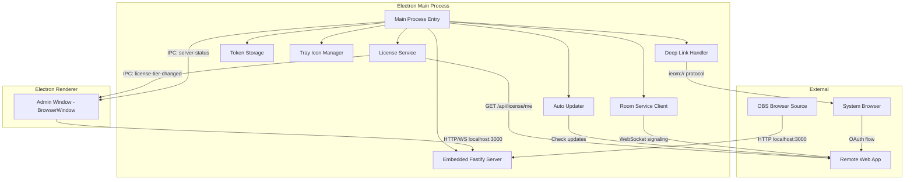
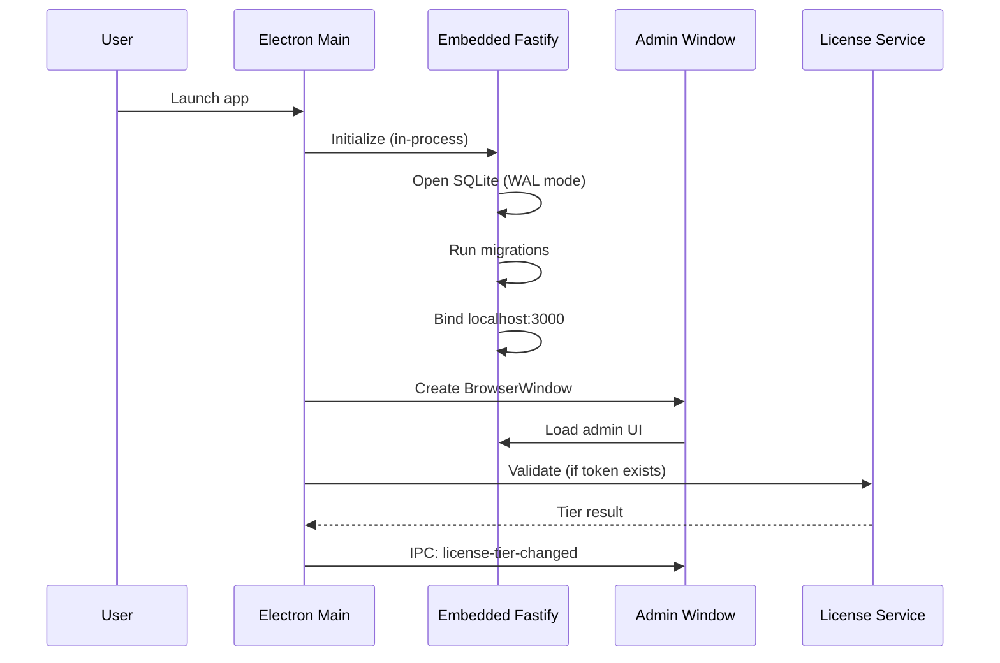
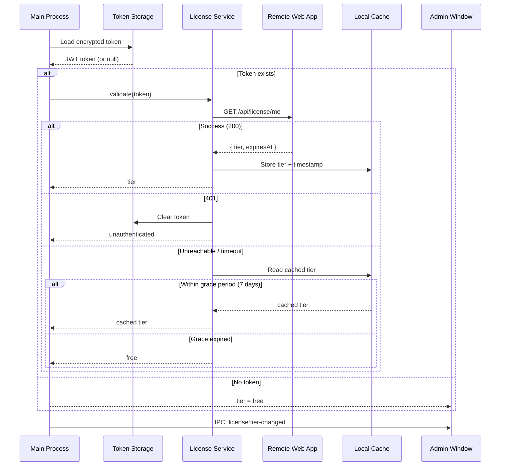

# Design Document: Electron Desktop App

## Overview

This design converts IEOM from a SaaS multi-tenant web application (PostgreSQL + Google OAuth + hosted deployment) into a self-contained Electron desktop application. The existing monorepo packages (`@ieom/server`, `@ieom/admin`, `@ieom/overlay`, `@ieom/shared`) are preserved and wrapped by a new `@ieom/desktop` package that provides the Electron shell.

The architecture introduces a clear separation between **local-only concerns** (embedded server, SQLite, overlay serving, admin window) and **remote-dependent concerns** (license validation, deep link auth, stream rooms, auto-updates). Local features work fully offline; remote features degrade gracefully.

### Key Design Decisions

1. **In-process server** — The Fastify server runs inside the Electron main process (not a child process), sharing the same Node.js event loop. This simplifies lifecycle management and IPC.
2. **SQLite reversion** — The server reverts from PostgreSQL to better-sqlite3 in WAL mode, removing all multi-tenant scoping.
3. **No local auth** — All localhost API routes and Socket.IO connections are unauthenticated. Authentication only exists for remote service communication.
4. **Deep link OAuth** — Authentication flows through the system browser to the Remote Web App, returning tokens via `ieom://auth?token=<jwt>`.
5. **Tiered feature gating** — License tier is exposed to the renderer via IPC; the admin UI conditionally enables/disables features.
6. **electron-builder** — Used for packaging, code signing, and auto-update distribution across Windows, macOS, and Linux.

## Architecture



### Process Model



## Components and Interfaces

### New Package: `@ieom/desktop`

A new workspace package at `packages/desktop/` containing the Electron application shell.

```
packages/desktop/
├── src/
│   ├── main/
│   │   ├── index.ts              # Electron app entry point
│   │   ├── server.ts             # Embedded server lifecycle
│   │   ├── window.ts             # Admin window management
│   │   ├── tray.ts               # System tray integration
│   │   ├── deeplink.ts           # Protocol handler (ieom://)
│   │   ├── license.ts            # License validation service
│   │   ├── token-storage.ts      # Safe storage wrapper
│   │   ├── auto-updater.ts       # electron-updater integration
│   │   ├── room-service.ts       # WebRTC room client
│   │   └── ipc-handlers.ts       # IPC channel definitions
│   └── preload/
│       └── index.ts              # Context bridge exposing IPC to renderer
├── electron-builder.yml          # Build/packaging config
├── package.json
└── tsconfig.json
```

### IPC Channel Definitions

| Channel | Direction | Payload | Purpose |
|---------|-----------|---------|---------|
| `license:get-tier` | Renderer → Main | — | Request current tier |
| `license:tier-changed` | Main → Renderer | `{ tier: string, expiresAt?: string }` | Tier update notification |
| `auth:login` | Renderer → Main | — | Initiate OAuth flow |
| `auth:logout` | Renderer → Main | — | Clear token |
| `auth:status` | Main → Renderer | `{ authenticated: boolean, user?: object }` | Auth state change |
| `server:status` | Main → Renderer | `{ running: boolean, error?: string }` | Server health |
| `app:get-version` | Renderer → Main | — | Get app version |
| `update:available` | Main → Renderer | `{ version: string }` | Update notification |
| `update:install` | Renderer → Main | — | Accept update |

### Modified Package: `@ieom/server`

The server package gains a **dual-mode entry point**:

- **Desktop mode** (default when imported by `@ieom/desktop`): No auth middleware, no PostgreSQL, SQLite via better-sqlite3, binds to `127.0.0.1` only.
- **Web mode** (existing `index.ts`): Full multi-tenant PostgreSQL + auth stack for the hosted SaaS.

A new `desktop-entry.ts` exports a `createDesktopServer(options)` factory function that:
1. Creates the Fastify instance
2. Registers static file serving (overlay at `/`, admin at `/admin`)
3. Registers all routes without auth middleware
4. Configures Socket.IO without auth handshake
5. Returns `{ app, io, start(), stop() }` for lifecycle control

```typescript
// packages/server/src/desktop-entry.ts
export interface DesktopServerOptions {
  dbPath: string        // Path to SQLite file
  port?: number         // Default 3000
  assetsDir: string     // Path to assets directory
  overlayDir: string    // Path to overlay dist
  adminDir: string      // Path to admin dist
}

export interface DesktopServer {
  app: FastifyInstance
  io: SocketIOServer
  start(): Promise<void>
  stop(): Promise<void>
  getPort(): number
}

export function createDesktopServer(options: DesktopServerOptions): Promise<DesktopServer>
```

### Modified Package: `@ieom/admin`

The admin UI gains awareness of the desktop context:

- A new `useDesktopBridge()` hook wraps the preload-exposed IPC API
- `AuthContext` is replaced with a desktop-aware variant that uses IPC instead of HTTP cookies
- Feature gating components read the license tier from IPC
- A `<ConnectionStatus>` component shows offline/online state

### Component Interaction: License Validation



## Data Models

### SQLite Schema (Desktop Mode)

The desktop mode reuses the existing schema from the architecture document (scenes, applications, desktop_config, widget_layouts, events, keybinds, obs_config, audio_config, overlay_style, desktop_ambiance, source_presets, media_library) with these additions:

```sql
-- License cache (single-row, id=1)
CREATE TABLE IF NOT EXISTS license_cache (
  id INTEGER PRIMARY KEY DEFAULT 1,
  tier TEXT NOT NULL DEFAULT 'free',
  last_validated_at TEXT,
  token_hash TEXT
);

-- Window state persistence (single-row, id=1)
CREATE TABLE IF NOT EXISTS window_state (
  id INTEGER PRIMARY KEY DEFAULT 1,
  x INTEGER,
  y INTEGER,
  width INTEGER NOT NULL DEFAULT 1280,
  height INTEGER NOT NULL DEFAULT 800,
  is_maximized INTEGER NOT NULL DEFAULT 0
);

-- App settings (single-row, id=1)
CREATE TABLE IF NOT EXISTS app_settings (
  id INTEGER PRIMARY KEY DEFAULT 1,
  launch_at_startup INTEGER NOT NULL DEFAULT 0,
  auto_update_enabled INTEGER NOT NULL DEFAULT 1
);
```

### Token Storage Format

```typescript
interface StoredToken {
  encryptedToken: Buffer  // Encrypted via safeStorage.encryptString()
  createdAt: string       // ISO timestamp
}
```

The token file is stored at `{App_Data_Directory}/auth-token.enc`. If `safeStorage` is unavailable, falls back to OS keychain, then plaintext with a warning.

### License Tier Enum

```typescript
type LicenseTier = 'free' | 'pro' | 'pro+rooms'

interface LicenseState {
  tier: LicenseTier
  lastValidatedAt: Date | null
  isGracePeriod: boolean
  gracePeriodExpiresAt: Date | null
}
```

### Feature Gate Map

```typescript
const FEATURE_GATES: Record<string, LicenseTier> = {
  'stream-rooms': 'pro+rooms',
  'advanced-ambiance-presets': 'pro',
  'priority-support': 'pro',
}
```


## Correctness Properties

*A property is a characteristic or behavior that should hold true across all valid executions of a system — essentially, a formal statement about what the system should do. Properties serve as the bridge between human-readable specifications and machine-verifiable correctness guarantees.*

### Property 1: Localhost-Only Binding

*For any* connection attempt from a non-localhost IP address, the Embedded Server SHALL reject the connection and not serve any response.

**Validates: Requirements 2.5**

### Property 2: No Authentication in Desktop Mode

*For any* HTTP route registered on the Embedded Server and *for any* Socket.IO namespace, requests and connections without authentication headers, cookies, or tokens SHALL be accepted and processed normally (no 401, 403, or connection rejection).

**Validates: Requirements 4.1, 4.2, 4.3**

### Property 3: Deep Link Token Extraction and JWT Validation

*For any* deep link URL in the format `ieom://auth?token=X`, if X is a non-empty string consisting of three non-empty base64url-encoded parts separated by dots (header.payload.signature), the token SHALL be accepted and stored. *For any* deep link URL where the token parameter is missing, empty, or not parseable as a three-part JWT, the token SHALL be rejected and an error notification displayed.

**Validates: Requirements 5.4, 5.5, 5.6**

### Property 4: Token Storage Round-Trip

*For any* valid JWT token string, encrypting it via Safe Storage and then decrypting the stored value SHALL produce the original token string unchanged.

**Validates: Requirements 6.1, 6.3**

### Property 5: Grace Period Tier Resolution

*For any* last-validated timestamp and current time, if the Remote Web App is unreachable: when the elapsed time since last validation is ≤ 7 days, the cached license tier SHALL be returned; when the elapsed time exceeds 7 days, the tier SHALL resolve to "free".

**Validates: Requirements 7.4, 7.6, 7.7**

### Property 6: Feature Gating by License Tier

*For any* feature in the feature gate map and *for any* license tier, the feature SHALL be enabled if and only if the user's tier meets or exceeds the feature's required tier (free < pro < pro+rooms). When a feature is disabled, the gate SHALL report the minimum required tier for that feature.

**Validates: Requirements 8.2, 8.3, 8.4, 8.6**

### Property 7: Maximum Peer Connection Limit

*For any* number of participants in a stream room (1 to N), the Room Service SHALL never establish more than 8 concurrent WebRTC peer connections, regardless of how many participants are present.

**Validates: Requirements 9.2**

### Property 8: Exponential Backoff with Cap

*For any* sequence of consecutive reconnection failures (count N ≥ 1), the delay before the next attempt SHALL equal min(2^(N-1) × 1000, 30000) milliseconds.

**Validates: Requirements 9.4**

### Property 9: Window Bounds Persistence Round-Trip

*For any* valid window bounds (x, y, width, height where width ≥ 1024 and height ≥ 768), persisting the bounds and then loading them on next launch SHALL restore the exact same position and size.

**Validates: Requirements 13.3**

### Property 10: Out-of-Bounds Window Position Reset

*For any* stored window position (x, y) that falls entirely outside the union of all currently available display bounds, the window SHALL be repositioned to the center of the primary display with default dimensions.

**Validates: Requirements 13.4**

## Error Handling

### Server Lifecycle Errors

| Error Condition | Handling Strategy |
|----------------|-------------------|
| Port 3000 in use | Native dialog with port conflict message; options: Retry / Quit |
| Server start timeout (>15s) | Native dialog; options: Retry / Quit |
| Unhandled exception in server | Native dialog with error details; options: Restart Server / Quit |
| Database corruption | Native dialog; prevent server start; suggest reinstall |
| Migration failure | Roll back failed migration; native dialog; prevent server start |

### Authentication Errors

| Error Condition | Handling Strategy |
|----------------|-------------------|
| Invalid deep link (no token) | System notification: "Authentication failed" |
| Token decryption failure | Delete corrupted file; notification: "Please log in again" |
| Safe Storage unavailable | Fallback chain: OS keychain → plaintext with warning |

### License Errors

| Error Condition | Handling Strategy |
|----------------|-------------------|
| 401 from license endpoint | Clear token; notify user to re-authenticate |
| Network timeout (10s) | Apply grace period rules silently |
| Non-401 HTTP error | Apply grace period rules silently |
| Grace period expired | Downgrade to free; show persistent banner in admin UI |

### Room/WebRTC Errors

| Error Condition | Handling Strategy |
|----------------|-------------------|
| Signaling disconnect | Exponential backoff reconnection (1s → 30s cap) |
| Peer connection timeout (15s) | Abandon peer; continue with others; notify admin UI |
| Token rejected (401) on join | Abort join; notify user to re-authenticate |
| Max peers reached (8) | Reject new peer connections; log warning |

### Auto-Update Errors

| Error Condition | Handling Strategy |
|----------------|-------------------|
| Download failure | Retry up to 3 times at 5-minute intervals |
| Signature verification failure | Discard update; notify user; do not apply |
| Update server unreachable | Silent failure; retry on next app start |

## Testing Strategy

### Property-Based Tests (fast-check)

The project already uses `fast-check` (present in `@ieom/server` devDependencies). Property-based tests will be written using fast-check with vitest as the test runner.

**Configuration:**
- Minimum 100 iterations per property test
- Each test tagged with: `Feature: electron-desktop-app, Property {N}: {description}`
- Tests located in `packages/desktop/src/__tests__/properties/`

**Properties to implement:**
1. Deep link token extraction and JWT validation (Property 3)
2. Token storage round-trip (Property 4)
3. Grace period tier resolution (Property 5)
4. Feature gating by license tier (Property 6)
5. Maximum peer connection limit (Property 7)
6. Exponential backoff with cap (Property 8)
7. Window bounds persistence round-trip (Property 9)
8. Out-of-bounds window position reset (Property 10)

Properties 1 and 2 (localhost binding, no auth) are better suited to integration tests since they require a running server instance.

### Unit Tests (vitest)

- Token storage: encrypt/decrypt with mocked safeStorage
- License service: HTTP response handling (200, 401, 500, timeout)
- Deep link handler: URL parsing edge cases
- Window manager: bounds validation, display detection
- Tray manager: context menu actions, icon state changes
- Auto-updater: retry logic, signature verification flow
- Server lifecycle: start/stop/restart sequencing

### Integration Tests

- Full server startup in desktop mode (no auth, SQLite, localhost-only)
- Admin window loading from embedded server
- Socket.IO connection without authentication
- IPC channel communication between main and renderer
- Deep link protocol handling end-to-end

### Platform Tests (CI matrix)

- Windows: protocol registration, installer creation, native module loading
- macOS: protocol registration, DMG creation, code signing
- Linux: .desktop file, AppImage creation

### Test Organization

```
packages/desktop/
├── src/__tests__/
│   ├── properties/           # Property-based tests (fast-check)
│   │   ├── deep-link.prop.test.ts
│   │   ├── token-storage.prop.test.ts
│   │   ├── license-grace.prop.test.ts
│   │   ├── feature-gate.prop.test.ts
│   │   ├── peer-limit.prop.test.ts
│   │   ├── backoff.prop.test.ts
│   │   └── window-bounds.prop.test.ts
│   ├── unit/                 # Unit tests
│   │   ├── license.test.ts
│   │   ├── token-storage.test.ts
│   │   ├── deep-link.test.ts
│   │   ├── window-manager.test.ts
│   │   ├── tray.test.ts
│   │   └── auto-updater.test.ts
│   └── integration/          # Integration tests
│       ├── server-desktop.test.ts
│       ├── ipc-channels.test.ts
│       └── socket-no-auth.test.ts
```
