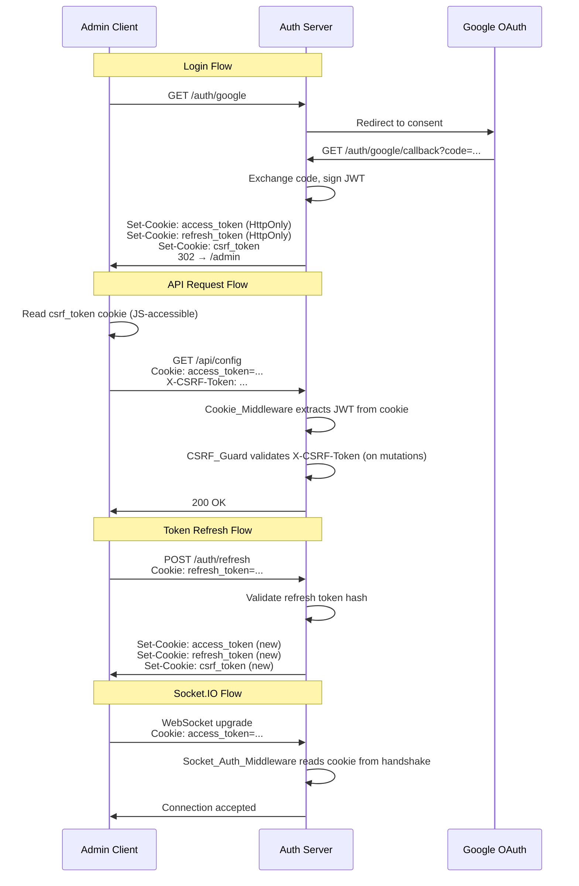

# Design Document: HttpOnly Cookie Authentication

## Overview

This design migrates the IEOM application from client-side JWT token management (tokens stored in sessionStorage, passed via Authorization headers and URL fragments) to a server-managed HttpOnly cookie authentication system. The migration eliminates XSS token theft vectors by ensuring authentication material is never accessible to JavaScript, while adding CSRF protection to guard against cross-site request forgery.

### Current State

- OAuth callback redirects to admin with tokens in URL fragment (`#access_token=...&refresh_token=...`)
- `AuthContext` reads tokens from the fragment, stores them in sessionStorage
- `api/client.ts` maintains a module-level `tokenStore` and attaches `Authorization: Bearer <token>` headers
- Socket.IO passes the token in `handshake.auth.token`
- Refresh is done by POSTing the refresh token in the request body

### Target State

- OAuth callback sets HttpOnly cookies directly and redirects with no token material in the URL
- No client-side token storage (no sessionStorage, no module variables)
- All requests use `credentials: "include"` — browser attaches cookies automatically
- CSRF protection via double-submit cookie pattern
- Socket.IO authenticates from cookies in the WebSocket handshake headers
- Auth status determined by calling `GET /auth/me`

## Architecture



## Components and Interfaces

### Server-Side Components

#### 1. Cookie Utility Module (`packages/server/src/auth/cookies.ts`)

Centralizes cookie configuration and setting/clearing logic.

```typescript
interface CookieOptions {
  httpOnly: boolean
  secure: boolean
  sameSite: 'Strict' | 'Lax' | 'None'
  path: string
  maxAge: number // seconds
}

interface AuthCookies {
  setAuthCookies(reply: FastifyReply, accessToken: string, refreshToken: string, csrfToken: string): void
  clearAuthCookies(reply: FastifyReply): void
  getCookieOptions(type: 'access' | 'refresh' | 'csrf'): CookieOptions
  generateCsrfToken(): string
}
```

- Reads `NODE_ENV` to determine `secure` and `sameSite` values
- Access token cookie: `HttpOnly, Path=/`
- Refresh token cookie: `HttpOnly, Path=/auth/refresh`
- CSRF token cookie: `NOT HttpOnly, Path=/` (readable by JS)

#### 2. Cookie Authentication Middleware (`packages/server/src/auth/authMiddleware.ts`)

Replaces the current `Authorization: Bearer` extraction with cookie-based extraction.

```typescript
// Updated middleware signature (same hook shape)
async function authMiddleware(request: FastifyRequest, reply: FastifyReply): Promise<void>
```

Changes:
- Reads `access_token` from `request.cookies` instead of `Authorization` header
- Ignores `Authorization` header entirely
- Returns `{ error: "token_expired" }` for expired JWTs
- Returns `{ error: "unauthorized" }` for missing/invalid JWTs

#### 3. CSRF Guard Middleware (`packages/server/src/auth/csrfMiddleware.ts`)

New middleware that validates CSRF tokens on state-changing requests.

```typescript
async function csrfGuard(request: FastifyRequest, reply: FastifyReply): Promise<void>
```

- Exempts `GET`, `HEAD`, `OPTIONS` methods
- Reads `csrf_token` cookie from request
- Compares against `X-CSRF-Token` header value
- Returns `403 { error: "csrf_invalid" }` on mismatch or missing header

#### 4. Updated Auth Routes (`packages/server/src/auth/authRoutes.ts`)

| Route | Changes |
|-------|---------|
| `GET /auth/google/callback` | Sets cookies via `setAuthCookies()`, redirects to `/admin` with no tokens in URL |
| `POST /auth/refresh` | Reads refresh token from cookie (not body), sets new cookies on success, clears cookies on failure |
| `POST /auth/logout` | Reads access token from cookie, invalidates refresh token, clears all cookies |
| `GET /auth/me` (NEW) | Returns user profile `{ id, email, name }` from cookie-authenticated request |

#### 5. Updated Socket Auth Middleware (`packages/server/src/auth/socketAuthMiddleware.ts`)

```typescript
function socketAuthMiddleware(socket: Socket, next: (err?: Error) => void): void
```

Changes:
- Reads JWT from `socket.handshake.headers.cookie` (parses the `access_token` cookie)
- No longer reads from `socket.handshake.auth.token`

### Client-Side Components

#### 6. Updated API Client (`packages/admin/src/api/client.ts`)

Complete rewrite removing all token storage:

```typescript
// No more tokenStore, setTokens, getAccessToken, clearTokens
// All functions use credentials: "include"

function getCsrfToken(): string | null  // reads from document.cookie
async function apiFetch<T>(path: string, init?: RequestInit): Promise<T>
async function apiSend(path: string, method: string, body?: unknown): Promise<void>
async function logout(): Promise<void>
```

- Every `fetch` call includes `credentials: "include"`
- State-changing requests (POST/PUT/PATCH/DELETE) include `X-CSRF-Token` header
- On 401 `token_expired`: POST `/auth/refresh` (with credentials), retry once
- On refresh failure: redirect to login

#### 7. Updated Auth Context (`packages/admin/src/auth/AuthContext.tsx`)

Simplified — no longer manages tokens:

```typescript
interface AuthContextValue {
  isAuthenticated: boolean
  user: { id: string; email: string; name: string } | null
  isLoading: boolean
  login: () => void
  logout: () => void
  checkAuth: () => Promise<void>
}
```

- On mount: calls `GET /auth/me` to determine auth status
- `isLoading` state while the initial check is in progress
- No sessionStorage, no token state, no `setTokens`
- `login()` redirects to `/auth/google`
- `logout()` calls `POST /auth/logout`, then redirects to login

#### 8. Updated Socket Client (`packages/admin/src/socket/client.ts`)

```typescript
export const socket: Socket = io('/', {
  withCredentials: true,
  autoConnect: false, // connect after auth check confirms user is authenticated
  // No auth callback — cookies are sent automatically
})
```

### Dependency: `@fastify/cookie`

The server needs the `@fastify/cookie` plugin to parse and set cookies. This is a well-maintained Fastify ecosystem package.

```
pnpm add @fastify/cookie --filter @ieom/server
```

## Data Models

### Cookie Specifications

| Cookie Name | HttpOnly | Secure | SameSite | Path | Max-Age |
|-------------|----------|--------|----------|------|---------|
| `access_token` | Yes | `NODE_ENV === 'production'` | Strict (prod) / Lax (dev) | `/` | 86400 (24h) |
| `refresh_token` | Yes | `NODE_ENV === 'production'` | Strict (prod) / Lax (dev) | `/auth/refresh` | 2592000 (30d) |
| `csrf_token` | No | `NODE_ENV === 'production'` | Strict (prod) / Lax (dev) | `/` | 86400 (24h) |

### CSRF Token Format

A cryptographically random 32-byte hex string generated via `crypto.randomBytes(32).toString('hex')`.

### `/auth/me` Response Shape

```typescript
interface AuthMeResponse {
  id: string
  email: string
  name: string
}
```

### Error Response Shapes

```typescript
// 401 from Cookie_Middleware
{ error: "unauthorized" }
{ error: "token_expired" }

// 401 from refresh endpoint
{ error: "refresh_invalid" }

// 403 from CSRF_Guard
{ error: "csrf_invalid" }
```

## Correctness Properties

*A property is a characteristic or behavior that should hold true across all valid executions of a system — essentially, a formal statement about what the system should do. Properties serve as the bridge between human-readable specifications and machine-verifiable correctness guarantees.*

### Property 1: Cookie flags are environment-correct

*For any* authentication cookie issued by the server (access_token, refresh_token, csrf_token), the Secure flag SHALL equal `(NODE_ENV === 'production')` and the SameSite value SHALL be `Strict` when `NODE_ENV === 'production'` and `Lax` otherwise.

**Validates: Requirements 1.1, 1.2, 1.4, 9.1, 9.2, 9.3, 9.4**

### Property 2: OAuth redirect contains no token material

*For any* successful OAuth callback that issues authentication cookies, the redirect Location header SHALL NOT contain any JWT token value, access token, or refresh token as a query parameter, fragment, or path segment.

**Validates: Requirements 1.3**

### Property 3: Invalid OAuth code produces no cookies

*For any* OAuth callback request with a missing or invalid authorization code, the response SHALL NOT contain any Set-Cookie headers for authentication cookies, and SHALL redirect to the login page with an error parameter.

**Validates: Requirements 1.5**

### Property 4: Cookie middleware extracts user identity

*For any* request containing a valid, non-expired JWT in the `access_token` cookie, the Cookie_Middleware SHALL set `request.userId` to the `sub` claim of that JWT.

**Validates: Requirements 2.1**

### Property 5: Cookie middleware rejects invalid tokens

*For any* request where the `access_token` cookie is missing or contains a JWT that fails signature verification, the Cookie_Middleware SHALL return a 401 response with error code `"unauthorized"`.

**Validates: Requirements 2.2**

### Property 6: Cookie middleware distinguishes expired tokens

*For any* request where the `access_token` cookie contains a JWT that is expired (valid signature but past `exp`), the Cookie_Middleware SHALL return a 401 response with error code `"token_expired"` (not `"unauthorized"`).

**Validates: Requirements 2.3**

### Property 7: Authorization header is ignored

*For any* request that contains a valid JWT in the Authorization header but has a missing or invalid `access_token` cookie, the Cookie_Middleware SHALL reject the request (proving it does not read from the Authorization header).

**Validates: Requirements 2.4**

### Property 8: Refresh endpoint issues new cookies on valid refresh

*For any* POST `/auth/refresh` request where the `refresh_token` cookie contains a valid, non-expired refresh JWT whose hash matches the stored hash, the server SHALL respond with 200 and set new `access_token`, `refresh_token`, and `csrf_token` cookies.

**Validates: Requirements 3.2**

### Property 9: Refresh endpoint rejects invalid refresh and clears cookies

*For any* POST `/auth/refresh` request where the `refresh_token` cookie is missing, expired, or has a hash that does not match the stored hash, the server SHALL respond with 401 and clear all authentication cookies.

**Validates: Requirements 3.3**

### Property 10: CSRF double-submit validation

*For any* state-changing request (POST, PUT, PATCH, DELETE) to a protected endpoint, the CSRF_Guard SHALL accept the request if and only if the `X-CSRF-Token` header value equals the `csrf_token` cookie value. Mismatched or missing values SHALL produce a 403 with error `"csrf_invalid"`.

**Validates: Requirements 4.3, 4.4**

### Property 11: CSRF exempts safe methods

*For any* GET, HEAD, or OPTIONS request, the CSRF_Guard SHALL not validate or require a CSRF token, regardless of whether the `X-CSRF-Token` header or `csrf_token` cookie is present.

**Validates: Requirements 4.5**

### Property 12: Socket middleware authenticates from handshake cookies

*For any* Socket.IO connection handshake that includes a valid JWT in the `access_token` cookie within the handshake headers, the Socket_Auth_Middleware SHALL accept the connection and set `socket.data.userId` to the JWT's `sub` claim.

**Validates: Requirements 5.2**

### Property 13: Socket middleware rejects missing/invalid handshake cookies

*For any* Socket.IO connection handshake where the `access_token` cookie is missing or contains an invalid JWT, the Socket_Auth_Middleware SHALL reject the connection with an `"authentication_error"` message.

**Validates: Requirements 5.3**

### Property 14: Logout invalidates token and clears all cookies

*For any* authenticated POST `/auth/logout` request, the server SHALL invalidate the user's refresh token hash in the database AND clear the `access_token`, `refresh_token`, and `csrf_token` cookies by setting them with expired dates.

**Validates: Requirements 6.1, 6.2**

### Property 15: /auth/me returns profile for valid cookie

*For any* GET `/auth/me` request with a valid `access_token` cookie, the server SHALL return a 200 response containing the user's `id`, `email`, and `name`.

**Validates: Requirements 8.1**

## Error Handling

### Server-Side Error Responses

| Scenario | Status | Body | Cookies Action |
|----------|--------|------|----------------|
| Missing/invalid access token cookie | 401 | `{ error: "unauthorized" }` | None |
| Expired access token cookie | 401 | `{ error: "token_expired" }` | None |
| Invalid/expired/mismatched refresh token | 401 | `{ error: "refresh_invalid" }` | Clear all auth cookies |
| Missing/mismatched CSRF token | 403 | `{ error: "csrf_invalid" }` | None |
| OAuth callback failure | 302 | Redirect to `/admin/login?error=oauth_failed` | No cookies set |

### Client-Side Error Handling

| Scenario | Action |
|----------|--------|
| 401 `token_expired` on any API call | Attempt refresh (POST `/auth/refresh`), retry original request once |
| Refresh succeeds | Retry original request with new cookies (automatic) |
| Refresh fails (401) | Clear auth state, redirect to login |
| 403 `csrf_invalid` | Should not happen in normal flow; log error, do not retry |
| Network error on logout | Still redirect to login (best-effort invalidation) |
| `/auth/me` returns 401 on page load | Show login page |

### Race Condition: Concurrent Refresh

Multiple concurrent requests may receive `token_expired` simultaneously. The client SHALL deduplicate refresh attempts using a shared promise (same pattern as current implementation) so only one `POST /auth/refresh` is in-flight at a time. Queued requests wait for the single refresh to complete, then retry.

## Testing Strategy

### Property-Based Tests (fast-check + vitest)

The server already has `fast-check` and `vitest` as dev dependencies. Property-based tests will validate the correctness properties defined above.

**Configuration:**
- Minimum 100 iterations per property test
- Each test tagged with: `Feature: httponly-cookie-auth, Property {N}: {title}`
- Tests target the pure logic layer (cookie option generation, middleware decision logic, CSRF validation)

**Test file:** `packages/server/src/auth/__tests__/cookieAuth.property.test.ts`

Properties to implement as PBT:
- Property 1: Cookie flags (generate random NODE_ENV values, verify flags)
- Property 4: Middleware extraction (generate random user IDs, sign tokens, verify extraction)
- Property 5: Middleware rejection (generate random invalid strings, verify 401)
- Property 6: Expired token distinction (generate tokens with past exp, verify error code)
- Property 7: Authorization header ignored (generate valid header + invalid cookie, verify rejection)
- Property 10: CSRF validation (generate random token pairs, verify accept/reject)
- Property 11: CSRF safe method exemption (generate random methods from GET/HEAD/OPTIONS, verify pass-through)
- Property 12: Socket cookie extraction (generate random user IDs in cookie format, verify extraction)
- Property 13: Socket rejection (generate invalid cookie values, verify rejection)

### Unit Tests (vitest)

**Test file:** `packages/server/src/auth/__tests__/cookieAuth.unit.test.ts`

Example-based tests for:
- OAuth callback happy path (sets all three cookies, redirects to /admin)
- OAuth callback error path (no cookies, redirects with error)
- Refresh endpoint happy path (new cookies, 200)
- Refresh endpoint failure paths (missing cookie, expired, hash mismatch)
- Logout endpoint (invalidates DB, clears cookies)
- `/auth/me` endpoint (returns profile or 401)
- CSRF exemption for GET/HEAD/OPTIONS
- Development mode cookie flags (Secure=false, SameSite=Lax)

### Integration Tests

- Full OAuth flow simulation (mock Google, verify cookie chain)
- Refresh flow end-to-end (expired access → refresh → new cookies → retry succeeds)
- Socket.IO connection with cookies (verify handshake succeeds)
- CSRF rejection on POST without header

### Client-Side Tests

If a test framework is added to the admin package:
- `apiFetch` includes `credentials: "include"`
- `apiFetch` attaches `X-CSRF-Token` on mutations
- Refresh retry logic (mock 401 → refresh → retry)
- Auth context calls `/auth/me` on mount
- Socket client uses `withCredentials: true` and no auth token
