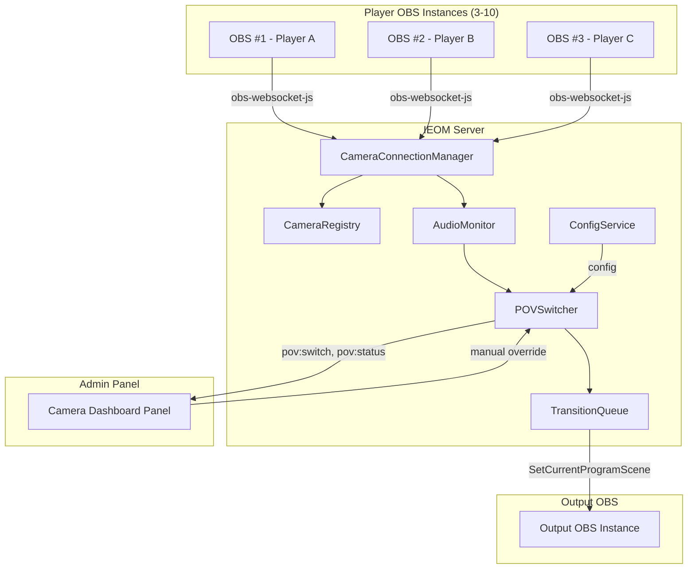

# Design Document: Multi-Camera POV Switching

## Overview

The Multi-Camera POV Switching feature extends the IEOM server to manage multiple simultaneous OBS WebSocket connections — one per player — and automatically switch the output stream between camera feeds based on real-time audio activity levels. The system maintains a Camera Registry that tracks connection state, polls audio volume meters from each OBS instance, computes rolling Activity Scores, and selects the most active camera for display. A manual override mode allows the host to lock onto a specific feed. All switching uses OBS scene transitions with a configurable queue to prevent jarring cuts.

This feature builds on the existing `ObsBridge` pattern (single OBS connection) and extends it to a multi-connection architecture while preserving the existing config persistence, Socket.IO event model, and admin panel patterns.

## Architecture



### Key Design Decisions

1. **Separate from existing ObsBridge**: The existing `ObsBridge` class manages the single "output" OBS connection. The multi-camera system introduces a new `CameraConnectionManager` that manages N player OBS connections independently. The output OBS remains managed by `ObsBridge` (or a reference to it) for issuing scene-change commands.

2. **Polling-based audio monitoring**: OBS WebSocket's `GetInputVolumeMeter` is polled at a configurable interval rather than relying on events, because OBS does not emit continuous volume data via events. This matches the requirements' polling model.

3. **Single-POV output model**: Only one camera is active at a time. The output OBS instance has scenes (or sources) mapped to each camera feed. Switching means commanding the output OBS to change its active scene/source.

4. **Event-driven admin sync**: All state changes (connections, scores, switches, mode changes) are broadcast to admin clients via Socket.IO events, following the existing pattern.

5. **Configuration in AppConfig**: POV switching config is added as a new top-level domain (`povConfig`) on `AppConfig`, persisted in a new `pov_config` single-row table, following the `obs_config` / `audio_config` pattern.

## Components and Interfaces

### 1. CameraRegistry (Server — `packages/server/src/pov/registry.ts`)

Tracks all registered camera feeds and their metadata.

```typescript
interface CameraFeed {
  id: string                    // Unique identifier (UUID)
  label: string                 // Player label (max 32 chars)
  obsAddress: string            // WebSocket URL (e.g., ws://192.168.1.10:4455)
  obsPassword: string           // OBS WebSocket password
  sceneName: string             // Scene/source name in output OBS mapped to this feed
  connectionStatus: 'connected' | 'disconnected' | 'reconnecting' | 'unresponsive' | 'unreachable'
  connectedAt: number | null    // Timestamp of last successful connection
  registeredAt: number          // Timestamp of registration
  lastHealthCheck: number | null // Timestamp of last successful health check
  activityScore: number         // Current computed activity score (0-1)
}

interface CameraRegistry {
  feeds: Map<string, CameraFeed>
  maxConnections: number        // Default 10
  
  register(feed: Omit<CameraFeed, 'id' | 'connectionStatus' | 'connectedAt' | 'registeredAt' | 'lastHealthCheck' | 'activityScore'>): CameraFeed | { error: string }
  unregister(feedId: string): boolean
  updateStatus(feedId: string, status: CameraFeed['connectionStatus']): void
  updateActivityScore(feedId: string, score: number): void
  getActiveFeed(feedId: string): CameraFeed | undefined
  getAllFeeds(): CameraFeed[]
  getConnectedFeeds(): CameraFeed[]
  findByAddress(address: string): CameraFeed | undefined
}
```

### 2. CameraConnectionManager (Server — `packages/server/src/pov/connections.ts`)

Manages independent OBS WebSocket connections to each player's OBS instance.

```typescript
interface CameraConnectionManager {
  connect(feed: CameraFeed): Promise<void>
  disconnect(feedId: string): void
  disconnectAll(): void
  getConnection(feedId: string): OBSWebSocket | undefined
  isConnected(feedId: string): boolean
  
  // Health checking
  startHealthChecks(intervalMs: number): void
  stopHealthChecks(): void
}
```

Internally uses `obs-websocket-js` (already a dependency). Each connection has its own retry logic with exponential backoff (15s → 30s → 60s → 120s → 300s, max 5 attempts), matching the existing `ObsBridge` pattern.

### 3. AudioMonitor (Server — `packages/server/src/pov/audio-monitor.ts`)

Polls audio levels from all connected cameras and computes Activity Scores.

```typescript
interface AudioMonitorConfig {
  pollIntervalMs: number        // Default 100, min 50, max 1000
  rollingWindowMs: number       // Default 2000, min 500, max 10000
  dbFloor: number               // Default -60
  dbCeiling: number             // Default 0
  emitIntervalMs: number        // Default 500, min 100, max 5000
}

interface AudioMonitor {
  start(config: AudioMonitorConfig): void
  stop(): void
  updateConfig(config: Partial<AudioMonitorConfig>): void
  getScores(): Map<string, number>  // feedId → activityScore
  onScoresUpdated(callback: (scores: Map<string, number>) => void): void
}
```

**Normalization formula**: `linearLevel = clamp((dbValue - dbFloor) / (dbCeiling - dbFloor), 0, 1)`

**Rolling average**: Maintains a circular buffer of normalized readings per feed over the configured window. Activity Score = mean of buffer values.

### 4. POVSwitcher (Server — `packages/server/src/pov/switcher.ts`)

Core decision engine that evaluates scores and triggers switches.

```typescript
interface POVSwitcherConfig {
  cooldownMs: number            // Default 3000, min 1000, max 30000
  activityThreshold: number     // Default 0.15, min 0.01, max 1.0
  silenceThreshold: number      // Default 0.05, min 0.0, max 1.0
}

type SwitchMode = 'automatic' | 'manual'

interface POVSwitcher {
  mode: SwitchMode
  activeCameraId: string | null
  
  setMode(mode: SwitchMode): void
  manualSelect(feedId: string): { ok: boolean; error?: string }
  evaluateScores(scores: Map<string, number>): void
  onSwitch(callback: (prev: string | null, next: string, timestamp: number) => void): void
  onModeChange(callback: (mode: SwitchMode) => void): void
  handleDisconnect(feedId: string): void
}
```

### 5. TransitionQueue (Server — `packages/server/src/pov/transition-queue.ts`)

Manages OBS transition commands with queuing to prevent conflicts.

```typescript
interface TransitionConfig {
  type: 'cut' | 'fade'         // Default 'cut'
  durationMs: number            // Default 0 for cut, 500 for fade; bounded 100-60000 for non-cut
}

interface QueuedSwitch {
  feedId: string
  timestamp: number
}

interface TransitionQueue {
  maxDepth: number              // Default 5
  enqueue(feedId: string): void
  isTransitioning(): boolean
  updateConfig(config: TransitionConfig): void
}
```

### 6. Socket Events (Shared — `packages/shared/src/contracts/socket.ts`)

New events added to the existing typed Socket.IO contract:

```typescript
// Server → Client
'pov:status': (payload: POVStatusPayload) => void
'pov:switch': (payload: POVSwitchPayload) => void
'pov:scores': (payload: POVScoresPayload) => void
'pov:feed:status': (payload: POVFeedStatusPayload) => void
'pov:error': (payload: POVErrorPayload) => void

// Client → Server
'pov:mode:set': (mode: 'automatic' | 'manual', callback?: (err: string | null) => void) => void
'pov:select': (feedId: string, callback?: (err: string | null) => void) => void
'pov:config:update': (config: Partial<POVSwitchingConfig>, callback?: (err: string | null) => void) => void
```

```typescript
interface POVStatusPayload {
  mode: SwitchMode
  activeCameraId: string | null
  feeds: Array<{
    id: string
    label: string
    connectionStatus: CameraFeed['connectionStatus']
    activityScore: number
  }>
}

interface POVSwitchPayload {
  previousFeedId: string | null
  newFeedId: string
  timestamp: number
  reason: 'automatic' | 'manual' | 'fallback'
}

interface POVScoresPayload {
  scores: Array<{ feedId: string; score: number }>
  timestamp: number
}

interface POVFeedStatusPayload {
  feedId: string
  connectionStatus: CameraFeed['connectionStatus']
  label: string
}

interface POVErrorPayload {
  feedId?: string
  message: string
  code: 'capacity_reached' | 'feed_unavailable' | 'transition_failed' | 'connection_failed'
}
```

### 7. REST Endpoints

```
GET    /api/config/pov          — Get POV switching configuration
PATCH  /api/config/pov          — Update POV switching parameters
GET    /api/pov/feeds           — List all registered camera feeds
POST   /api/pov/feeds           — Register a new camera feed
DELETE /api/pov/feeds/:id       — Unregister a camera feed
PATCH  /api/pov/feeds/:id       — Update feed metadata (label, scene mapping)
```

### 8. Admin Panel Component (Admin — `packages/admin/src/features/pov/CameraDashboard.tsx`)

React component displaying:
- List of all camera feeds with connection status indicators
- Real-time activity score bars (updated via `pov:scores` events)
- Active camera highlight
- Mode toggle (automatic/manual)
- Manual camera selection buttons
- Configuration controls (cooldown, threshold, transition type/duration)
- Empty state when no feeds are registered

## Data Models

### POV Switching Configuration (persisted)

Added to `AppConfig`:

```typescript
interface POVSwitchingConfig {
  pollIntervalMs: number        // Default 100
  rollingWindowMs: number       // Default 2000
  cooldownMs: number            // Default 3000
  activityThreshold: number     // Default 0.15
  silenceThreshold: number      // Default 0.05
  healthCheckIntervalMs: number // Default 10000
  maxConnections: number        // Default 10
  transition: {
    type: 'cut' | 'fade'        // Default 'cut'
    durationMs: number          // Default 0 (cut) or 500 (fade)
  }
  scoreEmitIntervalMs: number   // Default 500
  dbFloor: number               // Default -60
  dbCeiling: number             // Default 0
}

// Extended AppConfig
interface AppConfig {
  // ... existing fields ...
  povConfig?: POVSwitchingConfig
}
```

### Camera Feed Registration (persisted)

```typescript
// Stored in `pov_feeds` table
interface PersistedCameraFeed {
  id: string          // UUID primary key
  label: string       // Player label (max 32 chars)
  obs_address: string // WebSocket URL
  obs_password: string // Encrypted or plain password
  scene_name: string  // Mapped scene in output OBS
  registered_at: number // Unix timestamp
}
```

### Database Schema Additions

```sql
-- POV switching configuration (single-row, id=1)
CREATE TABLE IF NOT EXISTS pov_config (
  id INTEGER PRIMARY KEY DEFAULT 1,
  poll_interval_ms INTEGER NOT NULL DEFAULT 100,
  rolling_window_ms INTEGER NOT NULL DEFAULT 2000,
  cooldown_ms INTEGER NOT NULL DEFAULT 3000,
  activity_threshold REAL NOT NULL DEFAULT 0.15,
  silence_threshold REAL NOT NULL DEFAULT 0.05,
  health_check_interval_ms INTEGER NOT NULL DEFAULT 10000,
  max_connections INTEGER NOT NULL DEFAULT 10,
  transition_type TEXT NOT NULL DEFAULT 'cut',
  transition_duration_ms INTEGER NOT NULL DEFAULT 0,
  score_emit_interval_ms INTEGER NOT NULL DEFAULT 500,
  db_floor REAL NOT NULL DEFAULT -60,
  db_ceiling REAL NOT NULL DEFAULT 0
);

-- Registered camera feeds
CREATE TABLE IF NOT EXISTS pov_feeds (
  id TEXT PRIMARY KEY,
  label TEXT NOT NULL,
  obs_address TEXT NOT NULL,
  obs_password TEXT NOT NULL DEFAULT '',
  scene_name TEXT NOT NULL,
  registered_at INTEGER NOT NULL
);
```

### Runtime State (in-memory only)

```typescript
interface POVRuntimeState {
  mode: SwitchMode
  activeCameraId: string | null
  lastSwitchTimestamp: number | null
  transitionInProgress: boolean
  transitionQueue: QueuedSwitch[]
  scores: Map<string, number>
  connectionStatuses: Map<string, CameraFeed['connectionStatus']>
}
```


## Correctness Properties

*A property is a characteristic or behavior that should hold true across all valid executions of a system — essentially, a formal statement about what the system should do. Properties serve as the bridge between human-readable specifications and machine-verifiable correctness guarantees.*

### Property 1: Registration produces valid feed entry

*For any* valid camera feed configuration (label ≤ 32 characters, valid WebSocket address, valid scene name), registering it in the Camera Registry SHALL produce a feed entry with a unique ID, the provided label (truncated to 32 chars if needed), a connection timestamp, and the feed SHALL be retrievable by its ID.

**Validates: Requirements 1.1**

### Property 2: Reconnection reuses existing registration

*For any* registered camera feed that has been marked as disconnected, when a connection is re-established from the same OBS address, the Camera Registry SHALL restore the feed to active status using the same ID and registration data without creating a duplicate entry.

**Validates: Requirements 1.3**

### Property 3: Capacity enforcement

*For any* configured maximum connection limit (between 3 and 10), registering exactly that many feeds SHALL succeed, and any subsequent registration attempt SHALL be rejected with an error indicating capacity is reached.

**Validates: Requirements 1.4, 1.7**

### Property 4: Exponential backoff computation

*For any* retry attempt number N (0 through 4), the computed retry delay SHALL equal min(15000 × 2^N, 300000) milliseconds, and no more than 5 retry attempts SHALL be made before marking the feed as unreachable.

**Validates: Requirements 2.3**

### Property 5: Connection state change emits correct event

*For any* camera feed and any valid connection state transition, the system SHALL emit a status event containing the correct feed identifier and the new connection state value.

**Validates: Requirements 2.4**

### Property 6: Connection failure isolation

*For any* set of connected camera feeds, when one feed's connection fails, all other feeds SHALL retain their current connection status unchanged.

**Validates: Requirements 2.5**

### Property 7: Audio level normalization

*For any* dB value and any valid floor/ceiling configuration (floor < ceiling), the normalized output SHALL equal `clamp((dbValue - floor) / (ceiling - floor), 0, 1)`, producing exactly 0 for values at or below the floor, exactly 1 for values at or above the ceiling, and a linear interpolation between.

**Validates: Requirements 3.3**

### Property 8: Activity Score rolling average

*For any* sequence of normalized audio readings (each in [0, 1]) within the configured rolling window, the computed Activity Score SHALL equal the arithmetic mean of those readings, bounded between 0 and 1.

**Validates: Requirements 3.2**

### Property 9: Missing data zeroing and recovery

*For any* camera feed, if it fails to provide audio data for 3 or more consecutive poll cycles, its Activity Score SHALL be 0. When data resumes, the Activity Score SHALL be computed only from new readings without carrying over the zero values from the gap period.

**Validates: Requirements 3.4, 3.5**

### Property 10: Automatic switching threshold decision

*For any* set of activity scores with an active camera, the POV Switcher SHALL switch to a different feed only if that feed's score exceeds the current active feed's score by at least the configured activity threshold. If no feed exceeds the threshold, no switch SHALL occur.

**Validates: Requirements 4.1**

### Property 11: Silence threshold prevents switching

*For any* set of activity scores where ALL scores are below the configured silence threshold, the POV Switcher SHALL NOT trigger a switch regardless of score differences between feeds.

**Validates: Requirements 4.4**

### Property 12: Switch cooldown enforcement

*For any* sequence of automatic switch evaluations, no two automatic switches SHALL occur within a time interval less than the configured Switch Cooldown period.

**Validates: Requirements 4.2**

### Property 13: Initial camera selection without constraints

*For any* set of activity scores when no Active Camera is currently set (activeCameraId is null), the POV Switcher SHALL immediately select the feed with the highest Activity Score without applying the cooldown or activity threshold.

**Validates: Requirements 4.6**

### Property 14: Tie-breaking preserves current or selects least-recently-active

*For any* set of camera feeds where two or more share the highest Activity Score, if the current Active Camera is among the tied feeds it SHALL be retained; otherwise the feed that has been active least recently SHALL be selected.

**Validates: Requirements 4.7**

### Property 15: Disconnect triggers immediate fallback switch

*For any* state where the current Active Camera disconnects while in automatic mode, the POV Switcher SHALL immediately select the connected feed with the highest Activity Score, bypassing the Switch Cooldown.

**Validates: Requirements 4.8**

### Property 16: Manual mode suspends automatic switching

*For any* set of activity scores while the POV Switcher is in manual mode, no automatic switch SHALL be triggered regardless of score values or threshold comparisons.

**Validates: Requirements 5.2**

### Property 17: Manual selection rejects unavailable feeds

*For any* camera feed with a connection status other than 'connected', a manual selection attempt SHALL be rejected with an error indicating the feed is unavailable.

**Validates: Requirements 5.6**

### Property 18: Manual feed disconnect triggers automatic fallback

*For any* manually selected camera feed that disconnects, the POV Switcher SHALL change mode to automatic and select the highest-scoring connected feed.

**Validates: Requirements 5.5**

### Property 19: Configuration persistence round-trip

*For any* valid POVSwitchingConfig object, persisting it to the database and then loading it back SHALL produce an equivalent configuration with all field values preserved.

**Validates: Requirements 7.1**

### Property 20: Default values applied for missing config fields

*For any* partial POVSwitchingConfig with one or more fields missing, applying the withConfigDefaults function SHALL fill each missing field with its specified default value (pollIntervalMs: 100, rollingWindowMs: 2000, cooldownMs: 3000, activityThreshold: 0.15, silenceThreshold: 0.05).

**Validates: Requirements 7.4**

### Property 21: Out-of-bound values replaced with defaults

*For any* POVSwitchingConfig containing values outside their valid bounds (e.g., pollIntervalMs < 50 or > 2000, cooldownMs < 1000 or > 30000, activityThreshold < 0.01 or > 1.0), the validation function SHALL replace each out-of-bound field with its default value.

**Validates: Requirements 7.5**

### Property 22: Transition queue respects max depth

*For any* sequence of switch requests arriving while a transition is in progress, the queue SHALL hold at most 5 entries. When a 6th request arrives, the oldest entry SHALL be discarded before the new one is appended.

**Validates: Requirements 8.3, 8.5**

### Property 23: Queued requests for disconnected feeds are discarded

*For any* queued switch request, if the referenced camera feed has disconnected before the request is executed, that request SHALL be discarded and the next item in the queue SHALL be processed.

**Validates: Requirements 8.7**

## Error Handling

### Connection Errors

| Scenario | Behavior |
|----------|----------|
| OBS instance unreachable on initial connect | Retry with exponential backoff (15s → 300s cap, max 5 attempts). Mark as `unreachable` after exhaustion. Emit `pov:feed:status` event. |
| OBS instance drops mid-session | Mark as `disconnected`. If it was the active camera, trigger immediate fallback (Property 15/18). Begin reconnection attempts. |
| Health check timeout (5s) | Mark as `unresponsive`. Emit status event. Continue health checks — feed may recover. |
| Max capacity reached on registration | Reject with `capacity_reached` error. Emit `pov:error` to admin clients. |

### Audio Monitoring Errors

| Scenario | Behavior |
|----------|----------|
| GetInputVolumeMeter fails | Increment missed-poll counter. After 3 consecutive misses, set Activity Score to 0. |
| OBS returns invalid dB data | Treat as missed poll. Log warning. |
| All feeds silent | Remain on current camera (silence threshold rule). No switch triggered. |

### Transition Errors

| Scenario | Behavior |
|----------|----------|
| Output OBS fails to execute transition | Retry once after 500ms. If retry fails, skip transition, dequeue next, emit `pov:error` with `transition_failed` code. |
| Transition timeout (10s) | Force-dequeue next item. Log warning. |
| Queued feed disconnects before execution | Discard that queue entry. Process next. |

### Configuration Errors

| Scenario | Behavior |
|----------|----------|
| Invalid config values submitted | Replace out-of-bound values with defaults. Log warning. Return corrected config in response. |
| Database write failure | Return HTTP 500. Emit error to admin. Retain previous in-memory config. |
| Missing config on startup | Apply full defaults via `withConfigDefaults` pattern. |

### Admin Panel Errors

| Scenario | Behavior |
|----------|----------|
| Config save fails | Display error indicator. Retain form values for retry. |
| WebSocket disconnects | Show connection status indicator. Auto-reconnect (existing Socket.IO behavior). |
| Manual select of unavailable feed | Show error toast. Do not change active camera. |

## Testing Strategy

### Unit Tests (Example-Based)

Focus on specific scenarios and edge cases:

- Registration with exact 32-character label
- Registration with empty label (should fail validation)
- Health check timeout marking feed as unresponsive
- Retry exhaustion marking feed as unreachable
- Manual selection of connected feed succeeds
- Mode change emits correct event
- Transition retry on first failure, skip on second
- Empty state rendering in admin panel
- Config save error displays error indicator

### Property-Based Tests

Using **fast-check** (TypeScript property-based testing library) with minimum 100 iterations per property.

Each property test references its design document property:

```typescript
// Feature: multi-camera-pov-switching, Property 7: Audio level normalization
fc.assert(fc.property(
  fc.double({ min: -120, max: 20 }),  // dB value
  fc.double({ min: -100, max: -10 }), // floor
  fc.double({ min: -5, max: 10 }),    // ceiling
  (db, floor, ceiling) => {
    fc.pre(floor < ceiling)
    const result = normalizeDb(db, floor, ceiling)
    expect(result).toBeGreaterThanOrEqual(0)
    expect(result).toBeLessThanOrEqual(1)
    if (db <= floor) expect(result).toBe(0)
    if (db >= ceiling) expect(result).toBe(1)
  }
), { numRuns: 100 })
```

Properties to implement as PBT:
1. Registration validity (Property 1)
2. Reconnection reuse (Property 2)
3. Capacity enforcement (Property 3)
4. Exponential backoff computation (Property 4)
5. Connection failure isolation (Property 6)
6. Audio normalization (Property 7)
7. Rolling average computation (Property 8)
8. Missing data zeroing/recovery (Property 9)
9. Threshold switching decision (Property 10)
10. Silence threshold (Property 11)
11. Cooldown enforcement (Property 12)
12. Initial selection (Property 13)
13. Tie-breaking (Property 14)
14. Disconnect fallback (Property 15)
15. Manual mode suspension (Property 16)
16. Manual reject unavailable (Property 17)
17. Manual disconnect fallback (Property 18)
18. Config round-trip (Property 19)
19. Default values (Property 20)
20. Bounds validation (Property 21)
21. Queue max depth (Property 22)
22. Queue disconnected discard (Property 23)

### Integration Tests

- Full OBS WebSocket connection lifecycle (connect → poll → disconnect → reconnect)
- End-to-end switch: scores computed → decision made → OBS command issued → event emitted
- Config persistence via HTTP API → DB → reload on restart
- Socket.IO event delivery to multiple admin clients
- Transition queue processing with real timing

### Test Configuration

- **Framework**: Vitest (add to `@ieom/server` devDependencies)
- **PBT Library**: fast-check
- **Minimum PBT iterations**: 100 per property
- **Tag format**: `Feature: multi-camera-pov-switching, Property {N}: {title}`
- **Mocking**: OBS WebSocket connections mocked for unit/property tests; real connections for integration tests only
