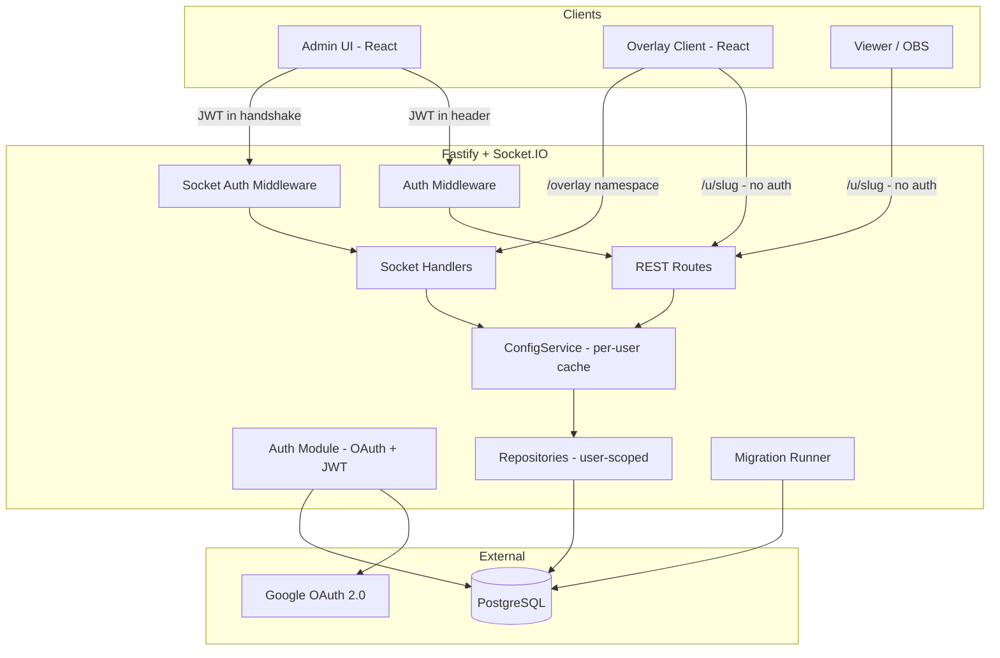

# Design Document: PostgreSQL Multi-Tenant Auth

## Overview

This design migrates the IEOM server from a single-tenant SQLite (better-sqlite3) architecture to a multi-tenant PostgreSQL architecture with Google OAuth 2.0 authentication. The core transformation involves:

1. **Database layer**: Replace the synchronous better-sqlite3 driver with an async PostgreSQL connection pool (`pg` / `pg-pool`), rewrite all repositories to use parameterized async queries with a mandatory `user_id` scope, and introduce a versioned migration runner.
2. **Authentication layer**: Add Google OAuth 2.0 login flow, JWT-based session management with refresh tokens, and Fastify request hooks that gate all admin routes.
3. **Multi-tenancy layer**: Introduce a `users` table, scope every data table with a `user_id` foreign key, convert the singleton `ConfigService` into a per-user cache with idle eviction, and scope Socket.IO rooms by user.
4. **Public access layer**: Serve overlay/player pages at `/u/{slug}/overlay` without auth, resolving the slug to a user_id for data loading and Socket.IO subscription.

The existing layering rule (Routes → Services → Repositories → DB) is preserved. The repository interface changes from synchronous to async, and every method gains a `userId` parameter.

## Architecture



### Key Architectural Decisions

| Decision | Rationale |
|----------|-----------|
| Use `pg` (node-postgres) pool directly, no ORM | Matches existing raw-SQL repository pattern; avoids heavy ORM overhead for a config-centric app |
| JWT in memory (not localStorage) on client | Prevents XSS token theft; refresh token handles persistence |
| Per-user in-memory config cache with LRU eviction | Preserves the fast synchronous `configService.get()` pattern for hot paths (socket handlers) while bounding memory |
| URL slug for public routes instead of UUID | Short, human-readable overlay URLs for streamers |
| Single shared database with row-level isolation | Simpler ops than schema-per-tenant; sufficient for expected user count |
| Migration runner with sequential versioned files | Matches existing `PRAGMA user_version` pattern, adapted to a `schema_migrations` table |

## Components and Interfaces

### 1. Database Pool (`db/pool.ts`)

```typescript
import { Pool, type PoolConfig } from 'pg'

export function createPool(): Pool {
  const config: PoolConfig = process.env.DATABASE_URL
    ? { connectionString: process.env.DATABASE_URL }
    : {
        host: process.env.PGHOST,
        port: parseInt(process.env.PGPORT ?? '5432', 10),
        database: process.env.PGDATABASE,
        user: process.env.PGUSER,
        password: process.env.PGPASSWORD,
      }
  return new Pool({ ...config, max: 20 })
}
```

### 2. Migration Runner (`db/migrationRunner.ts`)

```typescript
interface Migration {
  version: number
  name: string
  up: (client: PoolClient) => Promise<void>
}

export class MigrationRunner {
  constructor(private pool: Pool) {}
  async run(): Promise<void>           // Apply pending migrations in a transaction
  async getCurrentVersion(): Promise<number>
}
```

Migrations are defined as an ordered array. Each migration runs inside a transaction. On failure, the transaction rolls back and the process exits.

### 3. Auth Module (`auth/`)

| File | Responsibility |
|------|---------------|
| `auth/googleOAuth.ts` | Builds authorization URL, exchanges code for tokens, extracts profile |
| `auth/jwt.ts` | Sign/verify JWT, sign/verify refresh tokens |
| `auth/authRoutes.ts` | `GET /auth/google` (redirect), `GET /auth/google/callback`, `POST /auth/refresh`, `POST /auth/logout` |
| `auth/authMiddleware.ts` | Fastify `onRequest` hook for protected routes |
| `auth/socketAuthMiddleware.ts` | Socket.IO `use` middleware for default namespace |

```typescript
// auth/jwt.ts
export interface JwtPayload {
  sub: string    // user_id (UUID)
  email: string
  iat: number
  exp: number
}

export function signAccessToken(userId: string, email: string): string
export function verifyAccessToken(token: string): JwtPayload
export function signRefreshToken(userId: string): string
export function verifyRefreshToken(token: string): { sub: string }
```

### 4. User Repository (`db/repositories/UserRepository.ts`)

```typescript
export interface UserRecord {
  id: string           // UUID
  googleId: string
  email: string
  displayName: string
  avatarUrl: string | null
  slug: string         // URL-safe short identifier
  createdAt: Date
  updatedAt: Date
}

export class UserRepository {
  constructor(private pool: Pool) {}
  async findByGoogleId(googleId: string): Promise<UserRecord | null>
  async findBySlug(slug: string): Promise<UserRecord | null>
  async findById(id: string): Promise<UserRecord | null>
  async upsertFromGoogle(profile: GoogleProfile): Promise<UserRecord>
  async storeRefreshTokenHash(userId: string, hash: string): Promise<void>
  async getRefreshTokenHash(userId: string): Promise<string | null>
  async invalidateRefreshToken(userId: string): Promise<void>
}
```

### 5. Tenant-Scoped Repositories

Every existing repository gains:
- Constructor takes `Pool` instead of `DatabaseType`
- All methods become `async` and accept `userId: string` as first parameter
- All queries include `WHERE user_id = $N` clauses

Example (SceneRepository):

```typescript
export class SceneRepository {
  constructor(private pool: Pool) {}

  async findAll(userId: string): Promise<Record<string, Scene>> { ... }
  async save(userId: string, scene: Scene): Promise<void> { ... }
  async saveAll(userId: string, scenes: Record<string, Scene>): Promise<void> { ... }
  async delete(userId: string, id: string): Promise<void> { ... }
}
```

### 6. ConfigService (Multi-Tenant)

```typescript
export class ConfigService {
  private cache: Map<string, { config: AppConfig; lastAccess: number }>
  private evictionIntervalMs: number

  constructor(private repos: TenantRepositories, options?: { idleTimeoutMs?: number }) {}

  async getForUser(userId: string): Promise<AppConfig>
  async persistForUser(userId: string, next: AppConfig, updates?: Partial<AppConfig>): Promise<AppConfig>
  async seedNewUser(userId: string): Promise<void>
  evictIdle(): void
}
```

The service maintains a `Map<userId, CacheEntry>`. On access, it loads from DB if not cached. An interval timer evicts entries idle for longer than `idleTimeoutMs` (default 30 min).

### 7. Auth Middleware (`auth/authMiddleware.ts`)

```typescript
// Fastify onRequest hook
export function authMiddleware(request: FastifyRequest, reply: FastifyReply): Promise<void>

// Extends Fastify request
declare module 'fastify' {
  interface FastifyRequest {
    userId: string
  }
}
```

### 8. Socket Auth Middleware

```typescript
// Socket.IO middleware for default namespace
export function socketAuthMiddleware(socket: Socket, next: (err?: Error) => void): void
// Attaches userId to socket.data.userId
```

### 9. Public Route Resolver

```typescript
// Fastify plugin for /u/:slug/* routes
export async function publicRoutes(app: FastifyInstance, opts: { userRepo: UserRepository }): Promise<void>
// Resolves slug → userId, attaches to request, returns 404 if invalid
```

## Data Models

### Users Table

```sql
CREATE TABLE users (
  id UUID PRIMARY KEY DEFAULT gen_random_uuid(),
  google_id TEXT UNIQUE NOT NULL,
  email TEXT NOT NULL,
  display_name TEXT NOT NULL,
  avatar_url TEXT,
  slug TEXT UNIQUE NOT NULL,
  refresh_token_hash TEXT,
  created_at TIMESTAMPTZ NOT NULL DEFAULT NOW(),
  updated_at TIMESTAMPTZ NOT NULL DEFAULT NOW()
);

CREATE UNIQUE INDEX idx_users_google_id ON users(google_id);
CREATE UNIQUE INDEX idx_users_slug ON users(slug);
```

### Schema Migrations Table

```sql
CREATE TABLE schema_migrations (
  version INTEGER PRIMARY KEY,
  name TEXT NOT NULL,
  applied_at TIMESTAMPTZ NOT NULL DEFAULT NOW()
);
```

### Tenant-Scoped Tables (modified from existing)

Every existing table gains a `user_id UUID NOT NULL REFERENCES users(id)` column. The primary key changes from `id` alone to a composite or the `id` remains unique per-user via a unique constraint.

Example — scenes:

```sql
CREATE TABLE scenes (
  id TEXT NOT NULL,
  user_id UUID NOT NULL REFERENCES users(id) ON DELETE CASCADE,
  label TEXT NOT NULL,
  background_opaque BOOLEAN NOT NULL DEFAULT FALSE,
  sources_json JSONB NOT NULL DEFAULT '[]',
  style_json JSONB,
  lobby_config_json JSONB,
  transitions_json JSONB,
  PRIMARY KEY (user_id, id)
);
```

Example — single-row tables become single-row-per-user:

```sql
CREATE TABLE desktop_config (
  user_id UUID PRIMARY KEY REFERENCES users(id) ON DELETE CASCADE,
  global_theme_json JSONB,
  icon_animation TEXT,
  icon_arrangement TEXT,
  icon_motion REAL,
  icon_arrangement_motion REAL,
  default_icon_size TEXT,
  auto_arrange_icons BOOLEAN,
  recycle_bin_json JSONB,
  screen_saver_json JSONB,
  system_sounds_json JSONB,
  widget_positions_json JSONB,
  widget_sizes_json JSONB,
  widget_z_indices_json JSONB,
  widget_default_z_indices_json JSONB
);
```

### Full Table List with Tenant Scoping

| Table | Primary Key | Notes |
|-------|-------------|-------|
| `users` | `id` (UUID) | Not tenant-scoped — this IS the tenant table |
| `schema_migrations` | `version` | Global |
| `scenes` | `(user_id, id)` | Composite PK |
| `applications` | `(user_id, id)` | Composite PK |
| `desktop_config` | `user_id` | One row per user |
| `widget_layouts` | `(user_id, id)` | Composite PK |
| `events` | `(user_id, id)` | Composite PK |
| `keybinds` | `(user_id, scope, key)` | Composite PK |
| `obs_config` | `user_id` | One row per user |
| `audio_config` | `user_id` | One row per user |
| `overlay_style` | `user_id` | One row per user |
| `desktop_ambiance` | `user_id` | One row per user |
| `source_presets` | `(user_id, id)` | Composite PK |
| `media_library` | `(user_id, id)` | Composite PK |
| `pov_config` | `user_id` | One row per user |
| `pov_feeds` | `(user_id, id)` | Composite PK |
| `online_config` | `user_id` | One row per user |

### Environment Variables

| Variable | Required | Description |
|----------|----------|-------------|
| `PGHOST` | Yes* | PostgreSQL host |
| `PGPORT` | No | PostgreSQL port (default 5432) |
| `PGDATABASE` | Yes* | Database name |
| `PGUSER` | Yes* | Database user |
| `PGPASSWORD` | Yes* | Database password |
| `DATABASE_URL` | No | Alternative to individual PG* vars |
| `GOOGLE_CLIENT_ID` | Yes | OAuth client ID |
| `GOOGLE_CLIENT_SECRET` | Yes | OAuth client secret |
| `GOOGLE_REDIRECT_URI` | Yes | OAuth callback URL |
| `JWT_SECRET` | Yes | HMAC secret for JWT signing |
| `JWT_EXPIRATION` | No | Access token TTL (default "24h") |
| `REFRESH_TOKEN_EXPIRATION` | No | Refresh token TTL (default "30d") |

*Required unless `DATABASE_URL` is provided.


## Correctness Properties

*A property is a characteristic or behavior that should hold true across all valid executions of a system — essentially, a formal statement about what the system should do. Properties serve as the bridge between human-readable specifications and machine-verifiable correctness guarantees.*

### Property 1: JWT Sign/Verify Round-Trip

*For any* valid user_id (UUID) and email string, signing an access token and then verifying it should produce a payload where `sub` equals the original user_id and `email` equals the original email.

**Validates: Requirements 5.1**

### Property 2: User Upsert Idempotence

*For any* Google profile (google_id, email, name, picture), calling `upsertFromGoogle` twice with the same google_id should return the same user `id` both times, while the second call updates `display_name` and `avatar_url` to the latest values.

**Validates: Requirements 3.2, 3.3**

### Property 3: Slug URL-Safety and Uniqueness

*For any* generated user slug, the slug should match the pattern `^[a-z0-9][a-z0-9\-]*[a-z0-9]$` (URL-safe, lowercase alphanumeric with hyphens, no leading/trailing hyphens), and no two distinct users should share the same slug.

**Validates: Requirements 3.4**

### Property 4: Auth Middleware Token Validation

*For any* JWT string, the auth middleware should: (a) accept and attach the correct user_id if the token is valid and not expired, (b) return 401 with "expired" error code if the token is expired, (c) return 401 if the token is missing, malformed, or signed with a wrong secret.

**Validates: Requirements 6.1, 6.2, 6.3, 6.4**

### Property 5: Refresh Token Rotation Invalidates Previous

*For any* user with a valid refresh token, after performing a token refresh: the old refresh token should be rejected (401), and the new refresh token should be accepted. After logout, the current refresh token should also be rejected.

**Validates: Requirements 5.3, 5.4, 5.6**

### Property 6: Tenant Data Isolation

*For any* two distinct users A and B, and any tenant-scoped repository method (SELECT, UPDATE, DELETE), operations performed with user A's ID should never return or modify data belonging to user B. Specifically: inserting data for user A and querying as user B should return empty results.

**Validates: Requirements 8.2, 8.3, 8.4**

### Property 7: ConfigService Per-User Cache Isolation

*For any* two distinct users with different configurations, loading config for user A should return user A's data, and persisting a config update for user A should not alter the cached or persisted config for user B. Config events should only be emitted to sockets belonging to the updated user.

**Validates: Requirements 9.1, 9.2, 9.3, 9.4**

### Property 8: Cache Eviction by Idle Time

*For any* set of cached user configs with varying last-access timestamps, running eviction with a given idle timeout should remove exactly those entries whose last access is older than the timeout, and retain all others.

**Validates: Requirements 9.5**

### Property 9: New User Seeding Atomicity and Completeness

*For any* newly created user, after seeding completes, every tenant-scoped table should contain at least one row for that user_id with values derived from DEFAULT_CONFIG. If any insert fails, no rows for that user should exist in any tenant table (transaction rollback).

**Validates: Requirements 9.6, 13.1, 13.2**

### Property 10: Slug Resolution Correctness

*For any* user_slug string, if the slug corresponds to an existing user then resolution should return that user's ID, and if the slug does not correspond to any user then resolution should return null/not-found.

**Validates: Requirements 10.3, 10.4**

### Property 11: Environment Variable Validation

*For any* subset of the required environment variables (PGHOST, PGDATABASE, PGUSER, PGPASSWORD, GOOGLE_CLIENT_ID, GOOGLE_CLIENT_SECRET, JWT_SECRET) where at least one is missing, the server startup validation should fail and report which variables are absent.

**Validates: Requirements 14.2**

### Property 12: Room Ownership Association

*For any* authenticated user who creates an online room, the resulting room record should have its `user_id` field set to the creator's user ID, and the room should be accessible to unauthenticated participants scoped to that owner's data.

**Validates: Requirements 11.2, 11.3**

## Error Handling

### Authentication Errors

| Scenario | Response | Client Action |
|----------|----------|---------------|
| Missing/invalid JWT on protected route | 401 `{ error: "unauthorized" }` | Redirect to login |
| Expired JWT on protected route | 401 `{ error: "token_expired" }` | Attempt refresh |
| Invalid refresh token | 401 `{ error: "refresh_invalid" }` | Redirect to login |
| Google OAuth code exchange failure | 302 redirect to `/admin/login?error=oauth_failed` | Show error message |
| Google OAuth state mismatch | 302 redirect to `/admin/login?error=state_mismatch` | Show error message |

### Database Errors

| Scenario | Response | Recovery |
|----------|----------|----------|
| Pool connection failure on startup | Log error, `process.exit(1)` | Operator restarts with correct config |
| Migration failure | Log error, rollback transaction, `process.exit(1)` | Operator fixes migration and redeploys |
| Seeding failure for new user | Rollback transaction, return 500 to auth callback | User retries login |
| Query timeout | 500 `{ error: "internal" }` | Client retries |
| Unique constraint violation (slug collision) | Regenerate slug with suffix, retry | Transparent to user |

### Socket.IO Errors

| Scenario | Behavior |
|----------|----------|
| Invalid JWT in handshake | Reject connection with `{ message: "authentication_error" }` |
| Token expires during active connection | Server does not forcibly disconnect; client refreshes token and reconnects |
| User not found for socket userId | Disconnect socket, log warning |

### Public Route Errors

| Scenario | Response |
|----------|----------|
| Invalid user slug | 404 `{ error: "user_not_found" }` |
| Valid slug but user has no config (edge case) | Trigger seeding, then serve |

## Testing Strategy

### Property-Based Tests (fast-check)

The project already uses `fast-check` (devDependency in `@ieom/server`). Property-based tests will be written using `fast-check` with Vitest as the test runner.

**Configuration:**
- Minimum 100 iterations per property test (`{ numRuns: 100 }`)
- Each test tagged with: `// Feature: postgres-multi-tenant-auth, Property N: <title>`

**Properties to implement:**
1. JWT round-trip (pure function — sign/verify)
2. User upsert idempotence (requires test DB or mocked repo)
3. Slug URL-safety (pure function — slug generator)
4. Auth middleware token validation (unit with mocked verify)
5. Refresh token rotation (unit with mocked store)
6. Tenant data isolation (integration with test DB)
7. ConfigService cache isolation (unit with mocked repos)
8. Cache eviction by idle time (unit — pure time-based logic)
9. New user seeding atomicity (integration with test DB)
10. Slug resolution correctness (unit with mocked repo)
11. Environment variable validation (pure function)
12. Room ownership association (unit with mocked session manager)

### Unit Tests (Vitest)

- Auth module: OAuth URL construction, ID token parsing, error redirects
- Migration runner: version tracking, sequential application, rollback on failure
- ConfigService: `withConfigDefaults` application, patch event building
- Socket auth: handshake validation, namespace bypass for /overlay and /online
- Public route resolver: slug lookup, 404 handling
- Admin UI: login flow, token storage, refresh interceptor, logout

### Integration Tests

- Full auth flow: Google OAuth mock → user creation → JWT issuance → protected route access
- Migration runner against real PostgreSQL (Docker)
- Multi-tenant data isolation: two users, verify complete isolation across all tables
- Public overlay route: slug resolution → config loading → Socket.IO subscription
- Seeding: new user creation → verify all tables populated

### Test Infrastructure

- **Database**: Use `testcontainers` or a local Docker PostgreSQL for integration tests
- **Google OAuth**: Mock the token endpoint with `msw` (Mock Service Worker) or Fastify test injection
- **Environment**: Use `.env.test` with test-specific values; never use production secrets in tests
